import MdxLayout from "@/components/MdxLayout";

export const metadata = {
  title: "Web3 Development: The New Frontier of Software Engineering",
  description:
    "A deep guide to Web3 development covering blockchain fundamentals, smart contracts, testing, front‑end integration, CI/CD, security, scaling, and real‑world examples.",
  topics: ["Web3", "Web Architecture", "DeFi", "Web Development", "DevOps"],
};

export default function Web3DeepDive({ children }) {
  return <MdxLayout>{children}</MdxLayout>;
}

# Web3 Development: The New Frontier of Software Engineering

### Author: Son Nguyen

> Date: 2024‑06‑30

## 1. Why Web3?

Web3 moves power from centralized entities to users by leveraging:

- **Trustless Execution:** Code-enforced rules without intermediaries
- **User Sovereignty:** Self-custody of data & assets
- **Composability:** “Money legos” that interoperate
- **Permissionless Innovation:** Anyone can build & deploy

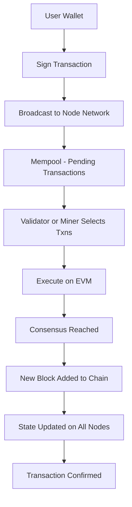

---

## 2. Core Concepts & Definitions

| Term                 | Definition                                                                                            | Example                            | Key Benefits                                     | Common Pitfalls                                   | Resources                                |
| -------------------- | ----------------------------------------------------------------------------------------------------- | ---------------------------------- | ------------------------------------------------ | ------------------------------------------------- | ---------------------------------------- |
| **Blockchain**       | Immutable, distributed ledger of transactions grouped into cryptographically linked blocks.           | Ethereum Mainnet                   | Censorship‑resistant; verifiable audit trail     | Network congestion; storage bloat                 | https://ethereum.org/en/developers/docs/ |
| **EVM**              | Gas‑metered virtual machine that executes smart contract bytecode deterministically across all nodes. | Ethereum Virtual Machine           | Deterministic execution; broad ecosystem support | Limited compute; gas complexity                   | https://docs.soliditylang.org/           |
| **Gas**              | Unit of computation cost for executing transactions and smart contract operations.                    | 21,000 gas for simple ETH transfer | Prevents network spam; incentivizes optimization | Fee volatility; unpredictable costs               | https://ethgasstation.info/              |
| **Smart Contract**   | Self‑executing on‑chain code enforcing business logic without intermediaries.                         | ERC‑20 token contract              | Trustless automation; transparent rules          | Bugs are permanent; security vulnerabilities      | https://docs.openzeppelin.com/contracts  |
| **Proxy Pattern**    | Upgradeable contract design separating storage (proxy) from logic (implementation).                   | OpenZeppelin Transparent Proxy     | Enables seamless upgrades; preserves state       | Increased complexity; storage collisions          | https://docs.openzeppelin.com/upgrades   |
| **IPFS**             | Content‑addressed, peer‑to‑peer storage network for immutable file hosting.                           | Storing NFT metadata               | Decentralized; censorship‑resistant              | Availability reliant on pinning; slower retrieval | https://docs.ipfs.io/                    |
| **DID**              | Decentralized Identifier standard mapping wallet addresses to user‑controlled identifiers.            | did:ethr:0x1234                    | User sovereignty; portable identity              | Fragmented standards; adoption hurdles            | https://www.w3.org/TR/did-core/          |
| **Rollup**           | Layer‑2 scaling solution batching off‑chain transactions and posting compressed proofs on-chain.      | Optimism                           | Lower fees; higher throughput                    | Delayed finality; bridge risk                     | https://optimism.io/docs/                |
| **Bridge**           | Protocol enabling cross‑chain asset transfers via locking/minting or messaging.                       | Wormhole                           | Interoperability; liquidity expansion            | Smart contract exploits; slippage                 | https://wormholenetwork.com/             |
| **Meta‑Transaction** | Mechanism allowing users to send gasless transactions via relayers covering gas fees.                 | Biconomy relayer                   | Improved onboarding; lower friction              | Reliance on trusted relayer; replay attacks       | https://docs.biconomy.io/                |
| **ZKP**              | Cryptographic proof enabling verification of data without revealing the underlying information.       | zkSNARK proof for private balances | Enhanced privacy; scalable proofs                | Complex setup; heavy computation                  | https://zokrates.github.io/              |
| **Subgraph**         | Decentralized indexing service exposing blockchain data through GraphQL APIs.                         | The Graph Vault subgraph           | Fast queries; real‑time indexing                 | Schema maintenance; indexing delays               | https://thegraph.com/docs/               |

---

## 3. Blockchain & EVM Internals

### 3.1 Merkle Patricia Trie

- **Structure:** Key-value store → efficient proofs
- **State Root:** Snapshot of entire state

### 3.2 Gas Accounting

| Opcode | Gas Cost | Purpose                      |
| ------ | -------: | ---------------------------- |
| SLOAD  |      800 | Read storage                 |
| SSTORE |    5,000 | Write storage (after Berlin) |
| CALL   |      700 | External call                |
| CREATE |   32,000 | Contract deployment          |

---

## 4. Solidity Fundamentals

### 4.1 Storage Layout & Packing

```solidity
contract Packing {
    uint256 a; // slot0
    uint128 b; // slot1 lower
    uint128 c; // slot1 upper
    bool d;    // slot2 lower
}
```

### 4.2 Common Patterns

| Pattern         | Use Case           | Code Snippet         |
| --------------- | ------------------ | -------------------- |
| Ownable         | Access control     | `onlyOwner` modifier |
| Pausable        | Emergency stop     | `whenNotPaused`      |
| ReentrancyGuard | Prevent reentrancy | `nonReentrant`       |

---

## 5. End‑to‑End DeFi Vault Example

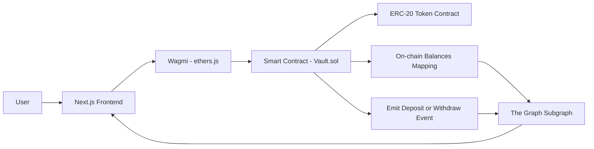

### 5.1 Contract Code

```solidity
// SPDX-License-Identifier: MIT
pragma solidity ^0.8.17;

import "@openzeppelin/contracts/token/ERC20/IERC20.sol";
import "@openzeppelin/contracts/security/ReentrancyGuard.sol";

contract Vault is ReentrancyGuard {
    IERC20 public immutable token;
    mapping(address=>uint256) public balances;

    event Deposit(address indexed user, uint256 amount);
    event Withdraw(address indexed user, uint256 amount);

    constructor(address _token) { token = IERC20(_token); }

    function deposit(uint256 amt) external nonReentrant {
        require(amt > 0, "Zero amount");
        token.transferFrom(msg.sender, address(this), amt);
        balances[msg.sender] += amt;
        emit Deposit(msg.sender, amt);
    }

    function withdraw(uint256 amt) external nonReentrant {
        require(balances[msg.sender] >= amt, "Insufficient balance");
        balances[msg.sender] -= amt;
        token.transfer(msg.sender, amt);
        emit Withdraw(msg.sender, amt);
    }
}
```

### 5.2 Gas Benchmarks (Foundry)

| Function | Gas Used |
| -------- | -------: |
| deposit  |   75,352 |
| withdraw |   48,189 |

---

## 6. Testing & Quality Assurance

### 6.1 Foundry Setup

```bash
forge init web3-vault
forge install OpenZeppelin/openzeppelin-contracts
```

### 6.2 VaultTest.sol

```solidity
contract VaultTest is Test {
    Vault vault; ERC20Mock token; address user = address(1);

    function setUp() public {
        token = new ERC20Mock("Token", "TKN", 18);
        vault = new Vault(address(token));
        token.mint(user, 1e18);
    }

    function testDepositWithdraw() public {
        vm.prank(user); token.approve(address(vault), 1e18);
        vm.prank(user); vault.deposit(1e18);
        assertEq(vault.balances(user), 1e18);
        vm.prank(user); vault.withdraw(1e18);
        assertEq(token.balanceOf(user), 1e18);
    }
}
```

### 6.3 Hardhat Coverage & Gas Report

```bash
npx hardhat coverage
npx hardhat gas-report --network hardhat
```

The wallet connection flow a user follows before calling a smart contract:

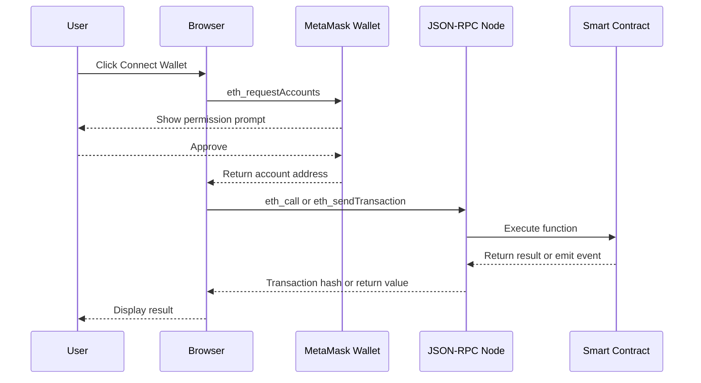

---

## 7. Front‑End Integration (Next.js + Wagmi)

```tsx
import { useAccount, useContractRead, useContractWrite } from "wagmi";
import VaultABI from "../abis/Vault.json";

export default function VaultUI() {
  const { address } = useAccount();
  const { data: balance } = useContractRead({
    address: process.env.NEXT_PUBLIC_VAULT_ADDRESS!,
    abi: VaultABI,
    functionName: "balances",
    args: [address],
  });
  const deposit = useContractWrite({ functionName: "deposit" });
  const withdraw = useContractWrite({ functionName: "withdraw" });

  return (
    <div>
      <h2>Balance: {balance?.toString()}</h2>
      <button onClick={() => deposit({ args: [1e18] })}>Deposit 1 TKN</button>
      <button onClick={() => withdraw({ args: [1e18] })}>Withdraw 1 TKN</button>
    </div>
  );
}
```

---

## 8. CI/CD Pipeline

```yaml
name: Web3 CI/CD
on: [push, pull_request]
jobs:
  test-and-deploy:
    runs-on: ubuntu-latest
    steps:
      - uses: actions/checkout@v3
      - run: npm install
      - run: forge test --gas-report
      - run: npx hardhat coverage
      - name: Deploy to Ethereum
        run: npx hardhat run scripts/deploy.ts --network mainnet
        env:
          PRIVATE_KEY: ${{ secrets.PRIVATE_KEY }}
          INFURA_API_KEY: ${{ secrets.INFURA_API_KEY }}
```

---

## 9. Security Best Practices

1. Slither static analysis
2. Echidna fuzz testing
3. MythX automated audits
4. Manual peer review
5. Checks-Effects-Interactions pattern
6. OpenZeppelin Defender monitoring

Consensus mechanism comparison across major blockchain designs:

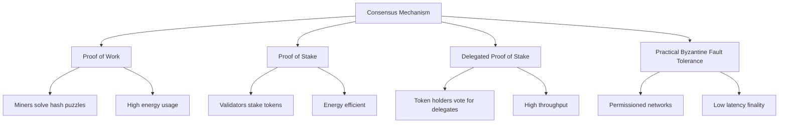

---

## 10. Layer‑2 & Cross‑Chain

### 10.1. Optimism Deployment Config

```js
module.exports = {
  networks: {
    optimism: {
      url: `https://optimism-mainnet.infura.io/v3/${process.env.INFURA}`,
      accounts: [process.env.PRIVATE_KEY],
    },
  },
};
```

### 10.2. Wormhole Bridge Script

```js
await token.approve(wormholeAddress, amount);
await wormhole.transferTokens(token.address, amount, destChainId, recipient);
```

| Bridge    | Finality | Fee (%) |
| --------- | -------: | ------: |
| Wormhole  |      15s |    0.10 |
| LayerZero |       7s |    0.05 |

---

## 11. Decentralized Storage (IPFS)

```js
import { create } from "ipfs-http-client";
const client = create({ url: "https://ipfs.infura.io:5001" });
async function uploadJSON(data) {
  const { cid } = await client.add(JSON.stringify(data));
  return cid.toString();
}
```

---

## 12. Decentralized Identity (DID)

```solidity
contract DIDRegistry {
    mapping(address => string) public did;
    function register(string calldata id) external {
        require(bytes(did[msg.sender]).length == 0, "Already registered");
        did[msg.sender] = id;
    }
    function resolve(address user) external view returns (string memory) {
        return did[user];
    }
}
```

---

## 13. On‑Chain Indexing (The Graph)

```yaml
specVersion: 0.0.2
dataSources:
  - name: Vault
    network: mainnet
    source: { address: "0xVault", abi: VaultABI }
    mapping:
      eventHandlers:
        - event: Deposit(address,uint256)
          handler: handleDeposit
        - event: Withdraw(address,uint256)
          handler: handleWithdraw
```

---

## 14. Meta‑Transactions

```solidity
function executeMeta(bytes calldata data, bytes calldata sig) external {
    require(_verify(msg.sender, data, sig), "Invalid");
    (bool success,) = address(this).call(data);
    require(success);
}
```

---

## 15. Zero‑Knowledge Proof Integration

```bash
circom multiplier.circom --r1cs --wasm
snarkjs groth16 setup multiplier.r1cs pot.ptau proof.zkey
snarkjs groth16 prove proof.zkey input.json proof.json public.json
```

---

## 16. Observability & Monitoring

- Tenderly alert rules
- Prometheus + Grafana dashboards
- Blocknative transaction notifications

---

## 17. Compliance & KYC

- Chainlink Proof‑Of‑Reserve
- Off-chain GDPR data storage

Layer-2 rollup architecture showing how transactions flow from user to L1:

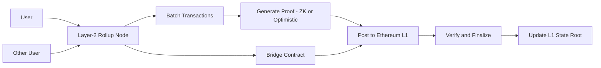

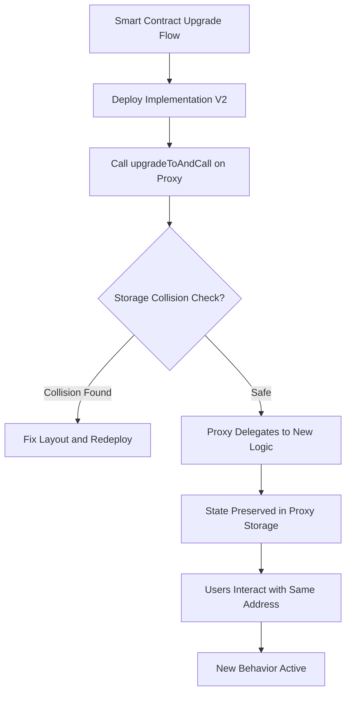

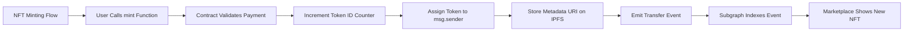

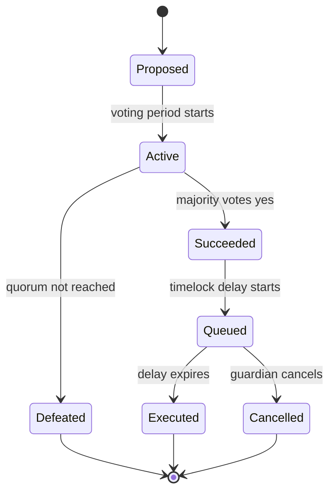

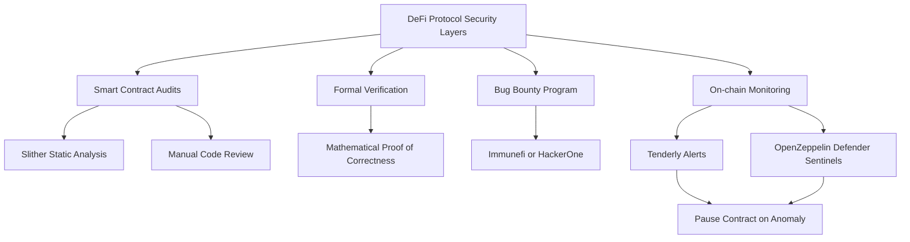

Gas cost is a first-class concern in Solidity development. Every opcode has a deterministic cost, and production contracts on Ethereum Mainnet can save users thousands of dollars through careful optimization.

### 17.1. Storage Packing and Layout

EVM storage is organized in 256-bit (32-byte) slots. Packing multiple smaller values into a single slot reduces the number of `SSTORE` operations (5,000+ gas each) required.

```solidity
// SPDX-License-Identifier: MIT
pragma solidity ^0.8.17;

// UNOPTIMIZED: 3 separate storage slots
contract Unoptimized {
    uint256 a;   // slot 0
    uint128 b;   // slot 1 (wastes upper 128 bits)
    uint128 c;   // slot 2 (wastes upper 128 bits)
    bool    d;   // slot 3 (wastes 255 bits)
}

// OPTIMIZED: 2 storage slots
contract Optimized {
    uint256 a;   // slot 0
    uint128 b;   // slot 1, bytes 0-15
    uint128 c;   // slot 1, bytes 16-31 — packed with b!
    bool    d;   // slot 2, byte 0
    // Declare additional small values after bool to pack into slot 2
    uint64  e;   // slot 2, bytes 1-8
    uint64  f;   // slot 2, bytes 9-16
}
```

### 17.2. Using `calldata` Instead of `memory` for Read-Only Arguments

Function parameters declared as `memory` are copied; `calldata` is read directly from the transaction input, saving copy gas on arrays and structs.

```solidity
// Costs more gas - copies the array to memory
function sumMemory(uint256[] memory values) external pure returns (uint256 total) {
    for (uint256 i; i < values.length; ++i) total += values[i];
}

// Cheaper - reads directly from calldata, no copy
function sumCalldata(uint256[] calldata values) external pure returns (uint256 total) {
    for (uint256 i; i < values.length; ++i) total += values[i];
}
```

### 17.3. Batch Operations to Amortize Fixed Costs

The base transaction cost (21,000 gas) is paid once per transaction. Batch operations that combine many state updates into a single call dramatically reduce per-operation cost.

```solidity
contract BatchTransfer {
    IERC20 public immutable token;

    constructor(address _token) { token = IERC20(_token); }

    /// @notice Transfer tokens to multiple recipients in a single transaction.
    /// @dev Saves ~21,000 gas base cost per extra transaction replaced.
    function multiTransfer(
        address[] calldata recipients,
        uint256[] calldata amounts
    ) external {
        require(recipients.length == amounts.length, "Length mismatch");
        for (uint256 i; i < recipients.length; ++i) {
            token.transferFrom(msg.sender, recipients[i], amounts[i]);
        }
    }
}
```

### 17.4. Custom Errors vs Revert Strings

Custom errors were introduced in Solidity 0.8.4 and cost significantly less gas than string revert messages because the ABI-encoded selector (4 bytes) replaces the full UTF-8 string in the revert data.

```solidity
// Expensive - stores and returns the full string in revert data
function withdrawOld(uint256 amt) external {
    require(balances[msg.sender] >= amt, "Insufficient balance");
    // ...
}

// Cheaper - ABI-encoded 4-byte selector only
error InsufficientBalance(address user, uint256 requested, uint256 available);

function withdraw(uint256 amt) external {
    if (balances[msg.sender] < amt) {
        revert InsufficientBalance(msg.sender, amt, balances[msg.sender]);
    }
    // ...
}
```

### 17.5. Gas Optimization Impact Table

| Technique              | Typical Savings          | When to Apply                        |
| ---------------------- | ------------------------ | ------------------------------------ |
| Storage slot packing   | 5,000-20,000 gas         | Structs with mixed-size fields       |
| `calldata` vs `memory` | 200-2,000 gas            | External functions with array params |
| Custom errors          | 100-500 gas per revert   | All require/revert statements        |
| Unchecked arithmetic   | 20-200 gas per op        | Loops with provably safe bounds      |
| Batch operations       | 21,000 gas per merged tx | Airdrop, multi-send, batch approval  |
| Immutable variables    | 200 gas per read         | Constants set in constructor         |

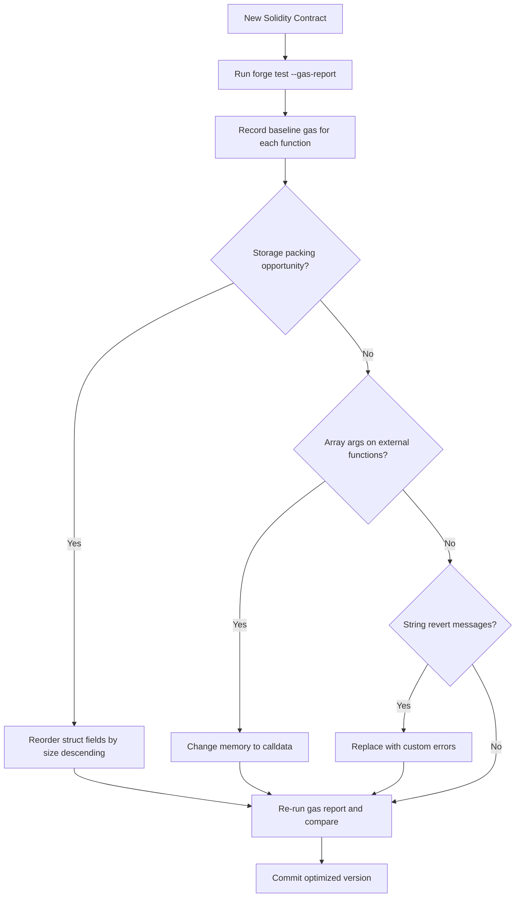

---

Deployed contracts are immutable by default. Upgradeability is achieved by separating storage from logic using a proxy pattern, where users always call the proxy and the proxy delegates execution to the current implementation.

### 17.6. UUPS (Universal Upgradeable Proxy Standard)

UUPS places the upgrade logic inside the implementation contract rather than the proxy. This produces a cheaper proxy (no admin storage slot read on every call) but requires care to avoid accidentally deploying an implementation without the upgrade function.

```solidity
// SPDX-License-Identifier: MIT
pragma solidity ^0.8.17;

import "@openzeppelin/contracts-upgradeable/proxy/utils/Initializable.sol";
import "@openzeppelin/contracts-upgradeable/proxy/utils/UUPSUpgradeable.sol";
import "@openzeppelin/contracts-upgradeable/access/OwnableUpgradeable.sol";

contract VaultV1 is Initializable, UUPSUpgradeable, OwnableUpgradeable {
    mapping(address => uint256) public balances;

    /// @custom:oz-upgrades-unsafe-allow constructor
    constructor() { _disableInitializers(); }

    function initialize(address owner_) public initializer {
        __Ownable_init(owner_);
        __UUPSUpgradeable_init();
    }

    function deposit() external payable {
        balances[msg.sender] += msg.value;
    }

    function withdraw(uint256 amt) external {
        require(balances[msg.sender] >= amt, "Insufficient");
        balances[msg.sender] -= amt;
        payable(msg.sender).transfer(amt);
    }

    // Required by UUPS - restrict who can upgrade
    function _authorizeUpgrade(address) internal override onlyOwner {}
}
```

```solidity
// VaultV2 adds an emergency pause feature
contract VaultV2 is VaultV1 {
    bool public paused;

    modifier whenNotPaused() {
        require(!paused, "Contract paused");
        _;
    }

    function setPaused(bool _paused) external onlyOwner {
        paused = _paused;
    }

    // Override deposit to add pause check
    function deposit() external payable override whenNotPaused {
        balances[msg.sender] += msg.value;
    }
}
```

### 17.7. Deploying and Upgrading with OpenZeppelin Hardhat Upgrades

```typescript
// scripts/deploy.ts
import { ethers, upgrades } from "hardhat";

async function main() {
  const VaultV1 = await ethers.getContractFactory("VaultV1");
  const [owner] = await ethers.getSigners();

  // Deploy proxy + implementation
  const proxy = await upgrades.deployProxy(VaultV1, [owner.address], {
    kind: "uups",
    initializer: "initialize",
  });
  await proxy.waitForDeployment();
  console.log("Proxy deployed to:", await proxy.getAddress());
}

// scripts/upgrade.ts
async function upgrade() {
  const proxyAddress = "0xYourProxyAddress";
  const VaultV2 = await ethers.getContractFactory("VaultV2");

  // Validates storage layout compatibility before deploying
  const upgraded = await upgrades.upgradeProxy(proxyAddress, VaultV2, {
    kind: "uups",
  });
  await upgraded.waitForDeployment();
  console.log("Upgraded to V2");
}
```

### 17.8. Transparent vs UUPS Proxy Comparison

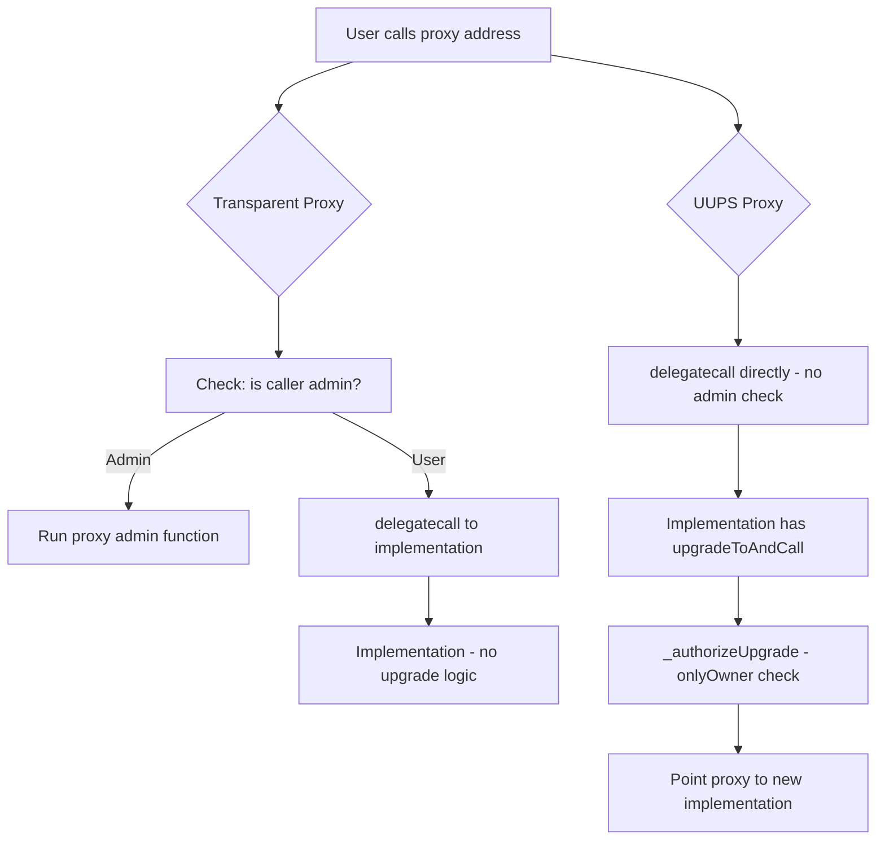

---

Layer-2 rollups reduce transaction costs by 10-100x compared to Ethereum Mainnet while inheriting Mainnet security. Most EVM-compatible contracts deploy unchanged to L2, but there are important differences in tooling and deployment.

### 17.9. Optimism Deployment with Hardhat

```typescript
// hardhat.config.ts
import { HardhatUserConfig } from "hardhat/config";
import "@nomicfoundation/hardhat-toolbox";

const config: HardhatUserConfig = {
  solidity: "0.8.24",
  networks: {
    "optimism-mainnet": {
      url: `https://optimism-mainnet.infura.io/v3/${process.env.INFURA_KEY}`,
      accounts: [process.env.PRIVATE_KEY!],
      chainId: 10,
    },
    "arbitrum-mainnet": {
      url: `https://arbitrum-mainnet.infura.io/v3/${process.env.INFURA_KEY}`,
      accounts: [process.env.PRIVATE_KEY!],
      chainId: 42161,
    },
    "base-mainnet": {
      url: "https://mainnet.base.org",
      accounts: [process.env.PRIVATE_KEY!],
      chainId: 8453,
    },
  },
  etherscan: {
    apiKey: {
      optimisticEthereum: process.env.OPTIMISTIC_ETHERSCAN_KEY!,
      arbitrumOne: process.env.ARBISCAN_KEY!,
    },
  },
};

export default config;
```

### 17.10. L1 to L2 Message Passing (Optimism)

Optimism provides a canonical bridge for sending messages from Ethereum Mainnet (L1) to Optimism (L2). This is used for governance actions or liquidity bridging.

```solidity
// L1 side - send a message to an L2 contract
interface ICrossDomainMessenger {
    function sendMessage(address target, bytes calldata message, uint32 minGasLimit) external;
}

contract L1Governor {
    ICrossDomainMessenger constant MESSENGER =
        ICrossDomainMessenger(0x25ace71c97B33Cc4729CF772ae268934F7ab5fA1);

    address public l2Vault;

    function setPausedOnL2(bool paused) external onlyOwner {
        bytes memory data = abi.encodeWithSignature("setPaused(bool)", paused);
        MESSENGER.sendMessage(l2Vault, data, 100_000 /* minGasLimit */);
    }
}
```

### 17.11. L2 Network Comparison

| Network       | Stack                 | Avg Gas Cost | Finality to L1          | EVM Compatibility           |
| ------------- | --------------------- | ------------ | ----------------------- | --------------------------- |
| Optimism      | OP Stack (Optimistic) | ~$0.01-0.05  | 7 days challenge window | Full EVM equivalence        |
| Arbitrum One  | Nitro (Optimistic)    | ~$0.01-0.05  | 7 days challenge window | Full EVM equivalence        |
| Base          | OP Stack (Optimistic) | ~$0.001-0.01 | 7 days challenge window | Full EVM equivalence        |
| zkSync Era    | ZK Rollup             | ~$0.01-0.05  | Hours (ZK proof)        | Near-EVM (some differences) |
| Polygon zkEVM | ZK Rollup             | ~$0.01-0.05  | Hours (ZK proof)        | Full EVM equivalence        |

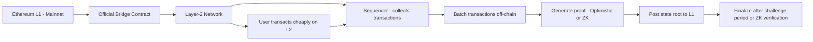

---

## 18. DAO Governance Case Study

| Metric        | Snapshot | On-chain Governor |
| ------------- | -------: | ----------------: |
| Cost          |    0 ETH |     75k gas (~$4) |
| Finality      |  Instant |              ~13s |
| Participation |      62% |               18% |

Architecture: Snapshot proposals → Subgraph indexing → Governor timelock → Execution

---

## 19. Conclusion

Web3 development combines cutting‑edge cryptography, decentralized infrastructure, and modern software engineering practices to build applications that empower users with true ownership of data, assets, and identity. Throughout this guide, you’ve learned:

- **Core Foundations:** How blockchains store state, gas economics, and the EVM execution model
- **Smart Contract Best Practices:** Storage packing, upgradeable proxies, reentrancy protection, and audited libraries
- **End‑to‑End Example:** A fully tested DeFi Vault contract, complete with gas benchmarks and exhaustive unit tests
- **Front‑End Integration:** Seamlessly connecting React (Next.js + Wagmi) to your smart contracts for a polished UX
- **Robust CI/CD:** Automated testing, coverage reporting, and production deployment pipelines using Forge, Hardhat, and GitHub Actions
- **Security & Compliance:** Static analysis (Slither), fuzz testing (Echidna), continuous monitoring (Tenderly), and KYC/GDPR strategies
- **Scalability & Interoperability:** Layer‑2 rollups (Optimism), cross‑chain bridges (Wormhole, LayerZero), and IPFS for decentralized storage
- **Advanced Topics:** Meta‑transactions for gasless UX, zero‑knowledge proofs for privacy, decentralized identity (DID), and on‑chain indexing (The Graph)

### 19.1. Further Resources

| Topic                      | Resource                                       | Description                                                            |
| -------------------------- | ---------------------------------------------- | ---------------------------------------------------------------------- |
| Ethereum Fundamentals      | https://ethereum.org/en/developers/docs/       | Official docs for blockchain basics, EVM, gas, and consensus           |
| Solidity                   | https://docs.soliditylang.org/                 | Language reference, best practices, and examples                       |
| OpenZeppelin Contracts     | https://docs.openzeppelin.com/contracts        | Secure, audited library of reusable smart contract components          |
| Foundry                    | https://book.getfoundry.sh/                    | Forge tutorial, testing, and gas reporting guide                       |
| Hardhat                    | https://hardhat.org/getting-started/           | Comprehensive dev environment for compilation, testing, and deployment |
| The Graph                  | https://thegraph.com/docs/                     | Building and deploying subgraphs for on-chain indexing                 |
| IPFS                       | https://docs.ipfs.io/                          | Getting started with decentralized file storage                        |
| Optimism                   | https://optimism.io/docs/                      | Layer‑2 rollup architecture, deployment, and bridges                   |
| Wormhole                   | https://wormholenetwork.com/docs               | Cross-chain messaging and token bridging guide                         |
| Slither                    | https://github.com/crytic/slither              | Static analysis tool for smart contract security                       |
| Echidna                    | https://github.com/crytic/echidna              | Fuzz testing framework for Ethereum contracts                          |
| Tenderly                   | https://tenderly.co/                           | Transaction tracing, monitoring, and alerting platform                 |
| Chainlink Proof‑Of‑Reserve | https://docs.chain.link/docs/proof-of-reserve/ | On-chain KYC and asset verification solutions                          |
| Zero‑Knowledge             | https://zokrates.github.io/                    | ZKP toolkit for building privacy‑preserving smart contracts            |
| Meta‑Transactions          | https://docs.biconomy.io/                      | Guides for implementing gasless UX                                     |

Whether you’re building the next DeFi protocol, NFT marketplace, DAO governance platform, or any other decentralized application, these resources - combined with the code patterns and best practices presented here - will help you deliver secure, scalable, and user‑centric Web3 solutions that redefine the boundaries of modern software engineering.
