import MdxLayout from "@/components/MdxLayout";

export const metadata = {
  title: "WebAssembly: Revolutionizing Web Performance",
  description:
    "An in-depth exploration of WebAssembly, its architecture, benefits, integration with JavaScript, and its impact on modern web applications.",
  topics: ["Tech Innovations", "Web Architecture", "Web Development"],
};

export default function WebAssemblyArticle({ children }) {
  return <MdxLayout>{children}</MdxLayout>;
}

# WebAssembly: Revolutionizing Web Performance

### Author: Son Nguyen

> Date: 2023-12-15

WebAssembly (often abbreviated as Wasm) is transforming the way we build web applications by enabling near-native performance in the browser. By allowing code written in languages such as C, C++, and Rust to run in a secure, sandboxed environment, WebAssembly bridges the gap between traditional web development and high-performance native applications.

---

## 1. Introduction

The web has evolved dramatically over the past decades, and as applications become more complex and performance-critical, the limitations of traditional JavaScript have become more apparent. WebAssembly emerged as a response to these challenges, offering a new paradigm for executing code on the web. With its compact binary format, rapid loading times, and near-native execution speed, Wasm is poised to revolutionize not only web performance but also the way developers approach application design.

In this article, we explore every facet of WebAssembly - from its core concepts and architecture to practical integration strategies and advanced applications. Whether you are a web developer, systems engineer, or technology enthusiast, this guide will provide you with a deep understanding of what WebAssembly is and how it is shaping the future of web development.

---

## 2. What is WebAssembly?

WebAssembly is a low-level, binary instruction format designed for efficient execution and compact representation. It serves as a compilation target for high-level languages, enabling developers to write code in languages beyond JavaScript and run it efficiently in the browser.

### 2.1 Key Characteristics

- **Binary Format:**
  WebAssembly modules are encoded in a binary format that is both compact and fast to decode. This helps reduce the download size and speeds up initialization.

- **Portability:**
  Supported by all major browsers, WebAssembly ensures consistent performance and behavior across different operating systems and devices.

- **Security and Sandboxing:**
  Running in a sandboxed environment, WebAssembly modules are isolated from the host system, ensuring that they cannot directly access system resources without proper permission.

- **Language Agnostic:**
  With WebAssembly, developers can write performance-critical code in languages like C, C++, Rust, and more, and compile it into a format that works seamlessly with JavaScript.

- **Performance:**
  Designed for high-performance scenarios, WebAssembly achieves speeds that are close to native code execution, making it ideal for compute-intensive applications.

---

## 3. Architecture and Core Concepts

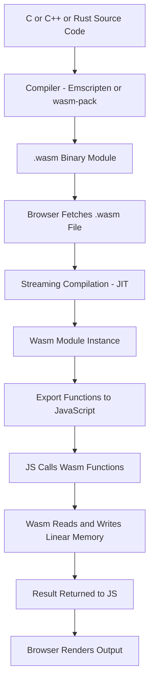

Understanding the underlying architecture of WebAssembly is key to leveraging its power. Here, we explore the core components and concepts that define Wasm.

### 3.1 Modules

- **Definition:**
  A WebAssembly module is the fundamental unit of deployment. It contains compiled code, definitions for functions, memory, tables, and other resources.

- **Structure:**
  Modules are organized into sections (such as type, import, function, memory, and export sections) that define how the module behaves and interacts with its environment.

### 3.2 Linear Memory

The Wasm linear memory model shows how the module, JavaScript, and the host share and isolate memory:

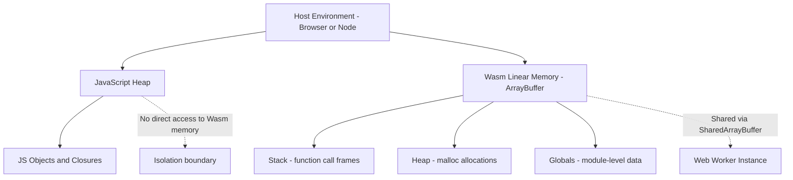

- **Concept:**
  WebAssembly uses a single, contiguous block of memory known as linear memory. This memory is separate from the JavaScript heap and is managed explicitly by the module.

- **Dynamic Resizing:**
  Linear memory can be dynamically grown at runtime, allowing applications to allocate more memory as needed while ensuring efficient data access.

### 3.3 Import and Export Mechanisms

- **Interoperability:**
  WebAssembly modules can import functions, memory, and other objects from the host environment (typically JavaScript) and can also export their own functions for external use.

- **Two-Way Communication:**
  This import/export mechanism enables tight integration between WebAssembly and JavaScript, allowing developers to offload compute-intensive tasks to Wasm while managing application logic in JavaScript.

### 3.4 Execution Environment

- **Sandboxing:**
  Wasm code runs within a secure, sandboxed environment, ensuring that it has no direct access to system resources. This design minimizes security risks and prevents malicious behavior.

- **Just-In-Time Compilation:**
  Modern browsers use Just-In-Time (JIT) compilation techniques to convert WebAssembly into optimized machine code on the fly, providing high-performance execution.

---

## 4. Advantages of WebAssembly

WebAssembly brings several key benefits to web development, making it an attractive choice for a wide range of applications.

### 4.1 Near-Native Performance

- **Compute-Intensive Tasks:**
  Wasm delivers performance that is close to native code, making it ideal for applications like game engines, image and video processing, and scientific simulations.

- **Optimized Execution:**
  The binary format and JIT compilation ensure that WebAssembly runs efficiently, often outperforming equivalent JavaScript code for compute-heavy tasks.

### 4.2 Portability and Consistency

- **Cross-Browser Support:**
  With all major browsers supporting WebAssembly, developers can create applications that behave consistently across platforms.

- **Seamless Integration:**
  WebAssembly modules can be loaded and executed in any environment that supports the Wasm standard, from desktop browsers to mobile devices.

### 4.3 Language Flexibility

- **Multi-Language Support:**
  Developers are not limited to JavaScript. They can choose from a variety of languages such as C, C++, Rust, and others to write performance-critical parts of their application.

- **Reuse of Existing Code:**
  Many existing libraries and legacy codebases can be compiled to WebAssembly, enabling their reuse in modern web applications without a complete rewrite.

### 4.4 Efficient Code Delivery

- **Compact Size:**
  The binary format of WebAssembly is much more compact than equivalent text-based code, reducing download times and improving startup performance.

- **Streaming Compilation:**
  Browsers can begin compiling WebAssembly modules as they are being downloaded, further reducing the time to interactive.

---

## 5. Integration with JavaScript


One of the most powerful aspects of WebAssembly is its ability to work alongside JavaScript. This section details how developers can integrate Wasm into their existing JavaScript applications.

### 5.1 Typical Workflow

- **Development:**
  Write performance-critical code in a language like C, C++, or Rust.

- **Compilation:**
  Use tools such as Emscripten or Rust’s `wasm-pack` to compile the code into a WebAssembly module.

- **Loading:**
  Fetch and instantiate the WebAssembly module in the browser using JavaScript.

- **Invocation:**
  Call exported WebAssembly functions directly from JavaScript, offloading heavy computations while maintaining overall application control in JavaScript.

### 5.2 Example: Integrating a Simple WebAssembly Module

Imagine a simple function that adds two numbers, written in C:

```c
// add.c
int add(int a, int b) {
  return a + b;
}
```

After compiling this code with a tool like Emscripten, you can load and use it in JavaScript as follows:

```javascript
async function loadWasm() {
  // Fetch the compiled WebAssembly binary
  const response = await fetch("add.wasm");
  const buffer = await response.arrayBuffer();

  // Instantiate the WebAssembly module
  const { instance } = await WebAssembly.instantiate(buffer);

  // Use the exported add function
  console.log("2 + 3 =", instance.exports._add(2, 3));
}

loadWasm();
```

This example demonstrates the seamless interaction between JavaScript and WebAssembly, leveraging Wasm’s performance benefits while using familiar JavaScript workflows.

---

## 6. Advanced Topics in WebAssembly

Beyond the basics, several advanced topics are crucial for harnessing the full potential of WebAssembly.

### 6.1 Debugging and Profiling

- **Debugging Tools:**
  Modern browsers now support source maps for WebAssembly, allowing developers to debug Wasm code using familiar tools like Chrome DevTools or Firefox Developer Tools.

- **Performance Profiling:**
  Profiling tools can measure Wasm module performance, helping developers identify bottlenecks and optimize their code further.

### 6.2 Memory Management and Optimization

- **Efficient Memory Usage:**
  Since WebAssembly uses its own linear memory, understanding how to manage and optimize memory usage is essential for high-performance applications.

- **Garbage Collection Interoperability:**
  Although Wasm itself does not provide garbage collection, integration with JavaScript means that developers need to manage memory effectively when passing data between Wasm and the JS environment.

### 6.3 Multithreading and Parallelism

The threading model shows how a Wasm module spawns workers and coordinates via shared memory:

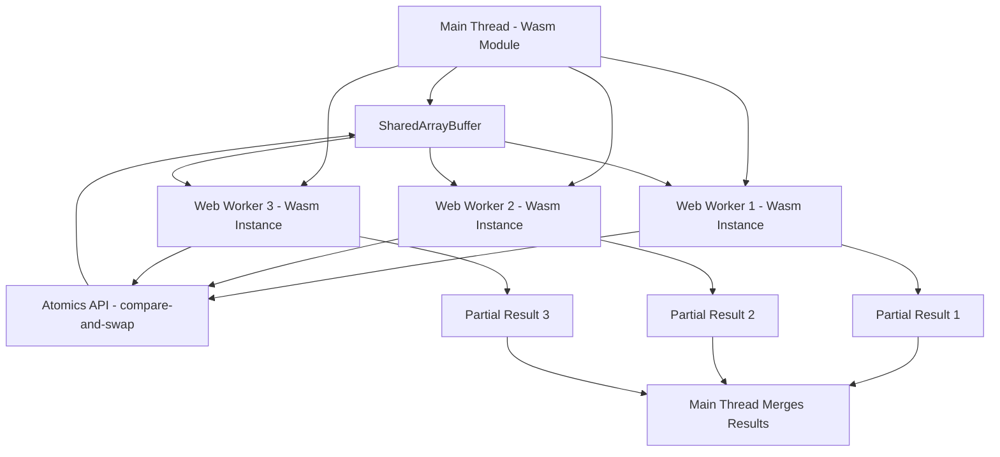

- **Web Workers:**
  WebAssembly can work with Web Workers to perform parallel computations, enabling multi-threaded processing in the browser.

- **Shared Memory:**
  With the advent of shared memory features, multiple WebAssembly instances can communicate and share data more efficiently, paving the way for parallel algorithms.

### 6.4 Security Considerations

- **Sandboxed Execution:**
  The security model of WebAssembly ensures that code runs in a confined environment, preventing unauthorized access to system resources.

- **Vulnerability Management:**
  Regular updates and audits are necessary to address any vulnerabilities, and developers should follow best practices for secure coding in both Wasm and its host environments.

---

## 7. The WebAssembly Ecosystem

The growing ecosystem around WebAssembly is one of its greatest strengths, providing a rich set of tools, frameworks, and communities.

The WebAssembly System Interface (WASI) extends Wasm beyond the browser by providing standardized system call access:

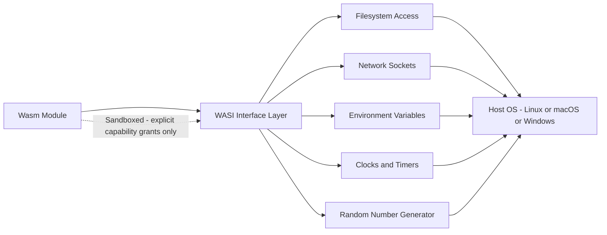

The table section in a Wasm module enables indirect function calls, which is how function pointers and virtual dispatch work in Wasm:

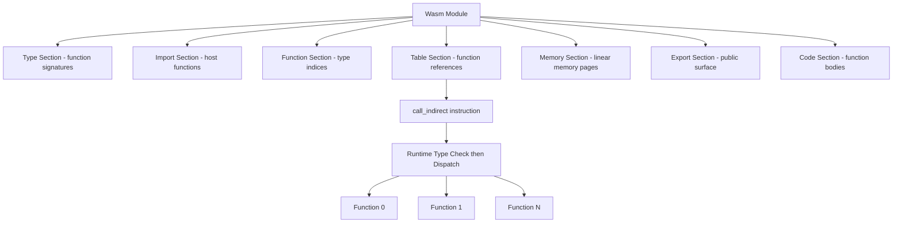

### 7.1 Tooling and Compilers

- **Emscripten:**
  A popular compiler toolchain that converts C and C++ code into WebAssembly.

- **Rust and wasm-pack:**
  Rust’s ecosystem includes `wasm-pack`, which simplifies compiling Rust code to WebAssembly and packaging it for use in JavaScript projects.

- **AssemblyScript:**
  A TypeScript-like language that compiles to WebAssembly, enabling JavaScript developers to write high-performance code with familiar syntax.

### 7.2 Frameworks and Libraries

- **Blazor:**
  Microsoft’s framework that uses WebAssembly to run .NET applications in the browser.

- **WebAssembly Studio:**
  An online IDE that allows you to experiment with WebAssembly, compile code, and see real-time results.

- **wasm-bindgen:**
  A library that facilitates high-level interactions between Rust and JavaScript, making it easier to pass data between the two environments.

### 7.3 Community and Adoption

- **Industry Adoption:**
  Major companies and projects are adopting WebAssembly for various applications, from game engines to data visualization.

- **Open Source Projects:**
  A vibrant community of developers is contributing to WebAssembly projects, fostering rapid innovation and improvements in the technology.

---

## 8. Real-World Use Cases

WebAssembly is already making a significant impact across various industries. Here are some prominent examples:

### 8.1 Game Development

- **High-Performance Rendering:**
  Game engines can offload complex physics calculations and rendering tasks to WebAssembly, resulting in smoother gameplay and faster response times.

- **Porting Legacy Games:**
  Many classic games are being ported to the web using WebAssembly, allowing them to run at near-native speeds directly in the browser.

### 8.2 Multimedia Processing

- **Image and Video Editing:**
  Applications that perform real-time image processing, video encoding, or filtering can benefit immensely from WebAssembly’s performance.

- **Audio Processing:**
  High-fidelity audio processing and effects can be implemented in Wasm, offering low-latency performance essential for music and sound editing tools.

### 8.3 Scientific Simulations and Data Analysis

- **Computational Simulations:**
  Scientific applications that require heavy numerical computations, such as simulations in physics or chemistry, can leverage WebAssembly to achieve faster processing times.

- **Data Visualization:**
  Complex data visualizations that require real-time interaction and rendering can use Wasm to offload intensive calculations from JavaScript.

WebAssembly is no longer limited to browsers. The following diagram shows how the same Wasm binary runs across different host environments via WASI and embedder APIs:

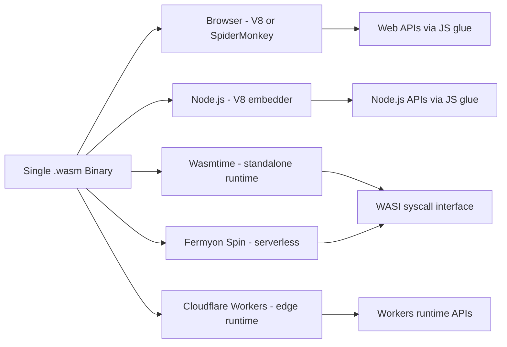

### 8.4 Cryptography and Security

- **Encryption/Decryption:**
  Secure cryptographic algorithms implemented in WebAssembly can provide both speed and security, essential for secure communications.

- **Blockchain and Distributed Systems:**
  Some blockchain projects use WebAssembly for smart contract execution due to its performance and security benefits.

---

## 9. Performance and Optimization Strategies

Achieving optimal performance with WebAssembly involves several strategies:

JavaScript and WebAssembly handle a compute-intensive task through very different execution paths:

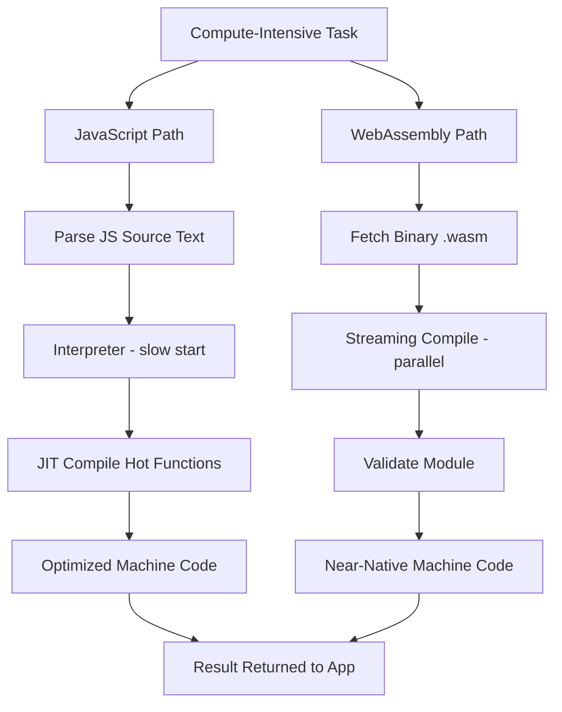

### 9.1 Code Optimization

- **Efficient Algorithms:**
  Use optimized algorithms and data structures when writing code for WebAssembly.

- **Compiler Optimizations:**
  Take advantage of optimization flags during the compilation process to generate faster and smaller Wasm binaries.

### 9.2 Memory and Resource Management

- **Minimize Data Transfer:**
  Reduce the overhead of passing data between JavaScript and WebAssembly by minimizing conversions and optimizing data structures.

- **Memory Pooling:**
  Manage memory manually where possible to avoid unnecessary allocations and deallocations.

### 9.3 Profiling and Benchmarking

- **Use Profiling Tools:**
  Leverage browser profiling tools and dedicated Wasm profilers to identify bottlenecks.

- **Iterative Testing:**
  Continuously test and optimize your code based on performance metrics and real-world usage patterns.

---

## 10. Challenges and Future Directions

Despite its many advantages, WebAssembly faces some challenges and is the subject of ongoing research and development.

The component model proposal allows Wasm modules to be composed into higher-level components with typed interfaces, enabling language-agnostic interoperability:

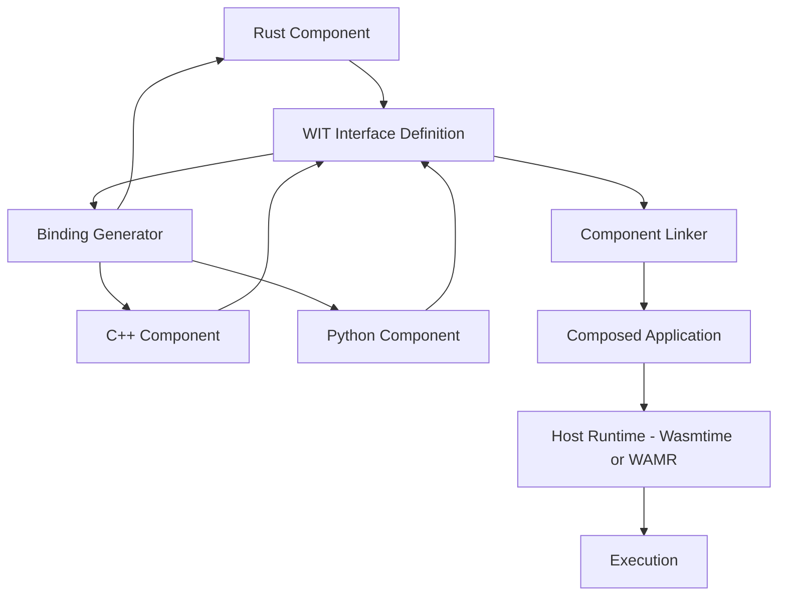

### 10.1 Current Limitations

- **Debugging Complexity:**
  Debugging low-level binary code can be challenging, although source maps and improved tooling are mitigating this issue.

- **Limited Standard Library:**
  Unlike higher-level languages, WebAssembly does not yet have a comprehensive standard library, so many functionalities must be implemented in the host environment.

- **Interoperability Overhead:**
  Data conversion between WebAssembly and JavaScript can incur performance costs that need to be carefully managed.

### 10.2 Future Developments

- **Multithreading Support:**
  Enhanced support for multithreading and shared memory is on the horizon, promising even greater performance improvements.

- **Extended Language Support:**
  As more languages adopt Wasm as a compilation target, the ecosystem will continue to grow.

- **Tooling Enhancements:**
  Continued improvements in debugging, profiling, and build tools will make developing in WebAssembly even more accessible.

- **Broader Ecosystem Integration:**
  WebAssembly is expected to play a larger role in server-side environments and IoT devices, further blurring the lines between web and native applications.

---

The WebAssembly System Interface (WASI) is a standardized API that grants Wasm modules access to OS resources - filesystem, network sockets, environment variables, clocks - without compromising the sandbox model.

### 10.3. WASI Deep Dive: Filesystem Access and System Calls

Unlike browser Wasm that communicates via JavaScript glue, WASI runs under runtimes like Wasmtime, WasmEdge, or Fermyon Spin and communicates directly with the host OS through capability-based permissions.

### 10.4. Filesystem Access with WASI in Rust

```rust
// src/main.rs - compiled to wasm32-wasi target
use std::fs;
use std::io::{self, Read, Write};

fn main() -> io::Result<()> {
    // WASI preopened directory: passed as --dir flag to the runtime
    let mut content = String::new();
    let mut file = fs::File::open("/preopened/input.txt")?;
    file.read_to_string(&mut content)?;

    let processed = content.to_uppercase();

    let mut out = fs::File::create("/preopened/output.txt")?;
    out.write_all(processed.as_bytes())?;

    println!("Processed {} bytes", content.len());
    Ok(())
}
```

```bash
# Compile to WASI target
cargo build --target wasm32-wasi --release

# Run with Wasmtime, granting only the /tmp directory
wasmtime run \
  --dir /tmp::/preopened \
  target/wasm32-wasi/release/my-processor.wasm
```

The `--dir /tmp::/preopened` flag is a capability grant: the module sees `/preopened` as a virtual path backed by `/tmp` on the host. Without this grant, any filesystem call raises a permission error - the module cannot touch anything else on the system.

### 10.5. WASI Capability Grant Model

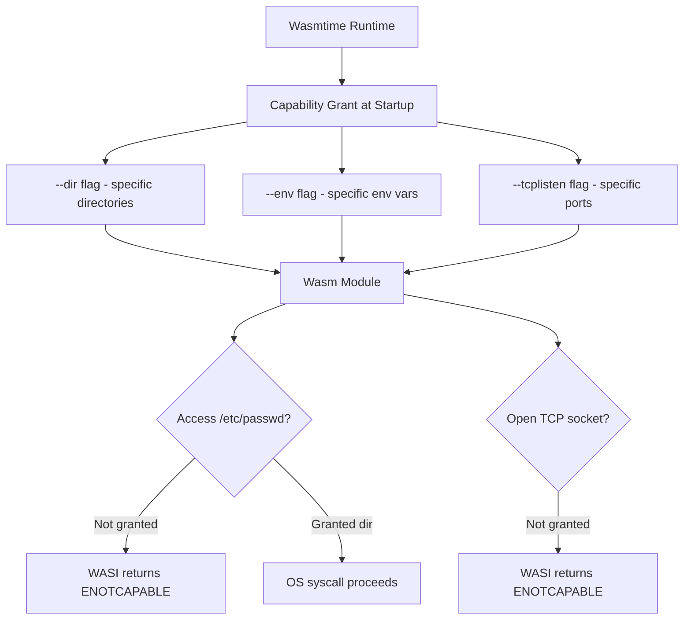

### 10.6. WASI Environment Variables and Args

```rust
use std::env;

fn main() {
    // Read environment variables passed via --env
    let db_url = env::var("DATABASE_URL").unwrap_or_else(|_| "sqlite://default.db".into());
    let port   = env::var("PORT").unwrap_or_else(|_| "8080".into());

    // Read command-line args
    let args: Vec<String> = env::args().collect();
    println!("Running on port {} with db={}", port, db_url);
    println!("Args: {:?}", &args[1..]);
}
```

```bash
wasmtime run \
  --env DATABASE_URL=postgres://localhost/mydb \
  --env PORT=3000 \
  target/wasm32-wasi/release/server.wasm -- --verbose
```

---

The Wasm Component Model is a proposal that standardizes how Wasm modules compose with each other and with the host. It introduces the **WebAssembly Interface Types (WIT)** definition language and a component linker that allows modules written in different languages to call each other through typed interfaces, without manual memory serialization.

### 10.7. WIT Interface Definition

```wit
// math.wit
package devverse:math@1.0.0;

interface calculator {
    add: func(a: f64, b: f64) -> f64;
    multiply: func(a: f64, b: f64) -> f64;
    factorial: func(n: u32) -> u64;
}

world math-world {
    export calculator;
}
```

### 10.8. Implementing a WIT Interface in Rust

```rust
// src/lib.rs
wit_bindgen::generate!({
    world: "math-world",
    path: "math.wit",
});

struct Calculator;

impl Guest for Calculator {
    fn add(a: f64, b: f64) -> f64 { a + b }
    fn multiply(a: f64, b: f64) -> f64 { a * b }
    fn factorial(n: u32) -> u64 {
        (1..=n as u64).product()
    }
}

export!(Calculator);
```

```bash
# Build as a Wasm component
cargo component build --release

# Compose with another component using wasm-tools
wasm-tools compose \
  -d target/wasm32-wasip1/release/math.wasm \
  app-component.wasm \
  -o composed.wasm
```

### 10.9. Component Model Composition Flow

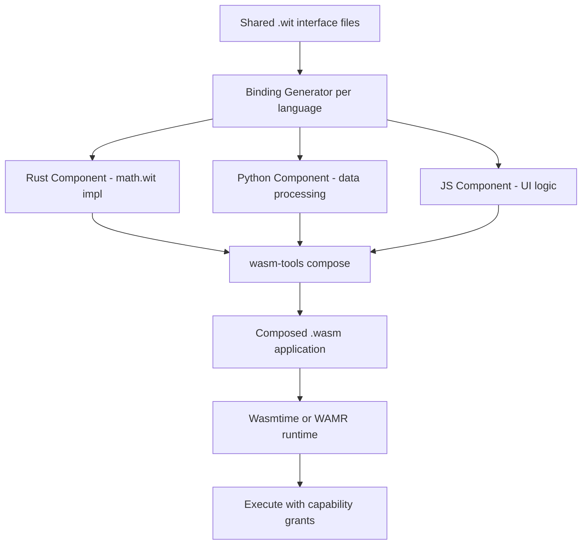

The key benefit over traditional linking is language independence: the Rust component, Python component, and JavaScript component communicate through typed WIT interfaces without knowing each other’s implementation details. The runtime validates all interface calls, providing type safety across language boundaries.

---

Wasm’s portability and sandboxing make it ideal for server-side execution. Fermyon Spin is a serverless framework that runs Wasm components as HTTP handlers, similar to AWS Lambda but with microsecond cold starts and true multi-tenant isolation.

### 10.10. Building an HTTP Handler with Spin (Rust)

```toml
# Cargo.toml
[dependencies]
spin-sdk = "2"

[lib]
crate-type = ["cdylib"]
```

```rust
// src/lib.rs
use spin_sdk::http::{IntoResponse, Request, Response};
use spin_sdk::http_component;

#[http_component]
fn handle_request(req: Request) -> anyhow::Result<impl IntoResponse> {
    let body = format!(
        "Hello from Wasm! Path: {}, Method: {}",
        req.uri().path(),
        req.method(),
    );
    Ok(Response::builder()
        .status(200)
        .header("content-type", "text/plain")
        .body(body)
        .build())
}
```

```toml
# spin.toml
spin_manifest_version = 2

[application]
name    = "my-spin-app"
version = "0.1.0"

[[trigger.http]]
route   = "/api/..."
component = "handler"

[component.handler]
source = "target/wasm32-wasip1/release/handler.wasm"
allowed_outbound_hosts = ["https://api.example.com"]

[component.handler.variables]
api_key = "{{ api_key }}"
```

```bash
# Build and run locally
cargo build --target wasm32-wasip1 --release
spin up

# Deploy to Fermyon Cloud
spin deploy
```

### 10.11. Wasmtime Embedding in a Rust Server

For full control, Wasmtime can be embedded directly in any Rust application. This pattern is used by databases (WasmEdge for serverless DB extensions), proxies (Envoy), and plugin systems.

```rust
use wasmtime::*;
use wasmtime_wasi::WasiCtxBuilder;

fn run_wasm_plugin(wasm_bytes: &[u8], input: &str) -> anyhow::Result<String> {
    let engine = Engine::default();
    let mut linker: Linker<wasmtime_wasi::WasiCtx> = Linker::new(&engine);
    wasmtime_wasi::add_to_linker(&mut linker, |cx| cx)?;

    let wasi_ctx = WasiCtxBuilder::new()
        .inherit_stdout()
        .env("INPUT", input)?
        .build();

    let mut store = Store::new(&engine, wasi_ctx);
    let module  = Module::from_binary(&engine, wasm_bytes)?;
    let instance = linker.instantiate(&mut store, &module)?;

    let run = instance.get_typed_func::<(), ()>(&mut store, "_start")?;
    run.call(&mut store, ())?;

    Ok("Plugin executed successfully".into())
}
```

### 10.12. Cold Start Comparison: Lambda vs Spin

| Runtime                   | Language   | Cold Start (p50) | Memory Floor |
| ------------------------- | ---------- | ---------------- | ------------ |
| AWS Lambda (Node.js)      | JavaScript | 150-400ms        | 128 MB       |
| AWS Lambda (Python)       | Python     | 200-600ms        | 128 MB       |
| AWS Lambda (Java)         | Java       | 800-2000ms       | 256 MB       |
| Fermyon Spin (Wasm)       | Rust/Go/JS | 1-5ms            | 1 MB         |
| Cloudflare Workers (Wasm) | Rust/JS    | Sub-millisecond  | 128 MB       |

The orders-of-magnitude difference in cold start comes from Wasm’s AOT compilation and the component model’s lack of a language runtime overhead.

---

Running ML model inference in Wasm enables client-side inference (privacy-preserving, no network round trip) and portable server-side inference without GPU dependencies for lightweight models.

### 10.13. ONNX Runtime with WebAssembly

ONNX Runtime Web compiles ONNX models to Wasm and can leverage WebGL or WebGPU for GPU acceleration.

```html
<!-- index.html -->
<script src="https://cdn.jsdelivr.net/npm/onnxruntime-web/dist/ort.min.js"></script>
```

```javascript
// inference.js
import * as ort from "onnxruntime-web";

async function runInference(imageTensor) {
  // Configure ONNX Runtime to use Wasm backend
  ort.env.wasm.wasmPaths = "/wasm/";

  const session = await ort.InferenceSession.create("./model.onnx", {
    executionProviders: ["wasm"], // or ["webgl"] for GPU
    graphOptimizationLevel: "all",
  });

  const feeds = {
    input: new ort.Tensor("float32", imageTensor, [1, 3, 224, 224]),
  };
  const results = await session.run(feeds);

  const output = results["output"].data;
  const topClass = Array.from(output).indexOf(Math.max(...output));
  return topClass;
}
```

### 10.14. Rust + WebAssembly for Edge Inference with WASI-NN

WASI-NN is a WASI proposal that provides a standard interface for neural network inference, allowing Wasm modules to use the host’s ML runtime (TensorFlow Lite, OpenVINO, etc.) without bundling the ML framework inside the Wasm binary.

```rust
// src/lib.rs
use wasi_nn::{ExecutionTarget, GraphBuilder, GraphEncoding, TensorType};

pub fn classify_image(image_bytes: &[u8]) -> anyhow::Result<Vec<f32>> {
    // Load a pre-converted TFLite model from the preopened directory
    let graph = GraphBuilder::new(GraphEncoding::Tensorflow, ExecutionTarget::CPU)
        .build_from_files(["/models/mobilenet_v2.tflite"])?;

    let mut ctx = graph.init_execution_context()?;

    // Set input tensor (preprocessed image pixels)
    ctx.set_input(0, TensorType::F32, &[1, 224, 224, 3], image_bytes)?;
    ctx.compute()?;

    // Read output probabilities
    let mut output = vec![0f32; 1001];
    ctx.get_output(0, &mut output)?;
    Ok(output)
}
```

### 10.15. Wasm AI Inference Architecture

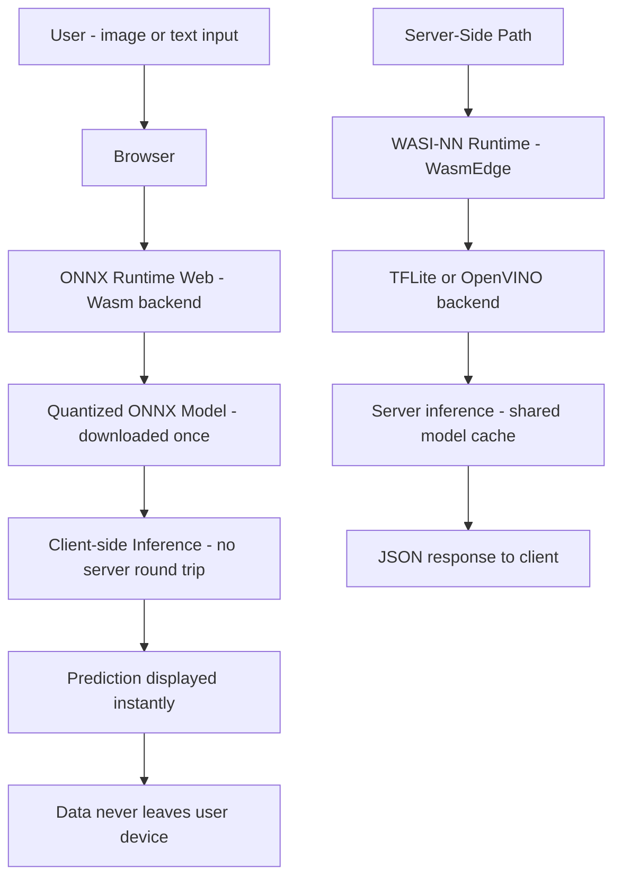

---

## 11. Conclusion

WebAssembly is revolutionizing web performance by providing a way to execute code at near-native speeds directly within the browser. Its robust architecture, efficient binary format, and seamless integration with JavaScript open up new possibilities for high-performance applications. From gaming and multimedia processing to scientific simulations and cryptography, WebAssembly is paving the way for a new era in web development.

By understanding its core concepts, leveraging advanced tools and techniques, and exploring its real-world applications, developers can build powerful, efficient, and secure web applications. As the technology evolves, WebAssembly will undoubtedly become an even more integral part of the modern web ecosystem.

For those looking to push the boundaries of what’s possible on the web, embracing WebAssembly is a crucial step towards creating next-generation applications.

---

## 12. Further Reading and Resources

- **Official Documentation:**
  [WebAssembly Documentation](https://webassembly.org/docs/)

- **Tutorials and Guides:**

  - Mozilla Developer Network (MDN) has extensive resources on WebAssembly.
  - Online courses and workshops on platforms like Udemy, Coursera, and Pluralsight.

- **Books:**

  - “Programming WebAssembly with Rust” – A hands-on guide to building WebAssembly applications.

- **Communities:**
  Join forums, GitHub repositories, and developer communities to stay updated on the latest advancements in WebAssembly.

---
