import MdxLayout from "@/components/MdxLayout";

export const metadata = {
  title: "Real-Time Communication with WebSockets in Node.js",
  description:
    "A comprehensive guide on leveraging WebSockets in Node.js to build real-time applications, covering the basics, implementation with the ws library, and best practices.",
  topics: ["Web Development"],
};

export default function WebSocketContent({ children }) {
  return <MdxLayout>{children}</MdxLayout>;
}

# Real-Time Communication with WebSockets in Node.js

### Author: Son Nguyen

> Date: 2023-08-30

Real-time communication has become a cornerstone of modern web applications. Whether it’s powering live chat systems, instant notifications, collaborative tools, or interactive dashboards, real-time data exchange is essential for a seamless user experience. In this article, we explore how to implement real-time communication using **WebSockets** in Node.js. We’ll cover everything from the basics of the WebSocket protocol to advanced strategies for scaling and securing your applications.

---

## 1. Introduction

Traditional web communication is built around the HTTP request-response model, which is inherently one-way and stateless. This model can be inefficient for applications that require continuous data updates, as it relies on repeated polling or long-polling techniques.

**WebSockets** provide a revolutionary solution: a persistent, bi-directional communication channel that allows the server and client to exchange data in real time over a single connection. With WebSockets, once the connection is established, data can flow freely in both directions with minimal overhead and low latency.

Node.js, with its event-driven, non-blocking I/O model, is an excellent choice for building WebSocket servers. Combined with lightweight libraries such as [ws](https://www.npmjs.com/package/ws), Node.js makes it straightforward to develop and scale real-time applications.

The following diagram compares the HTTP polling model with the WebSocket persistent connection:

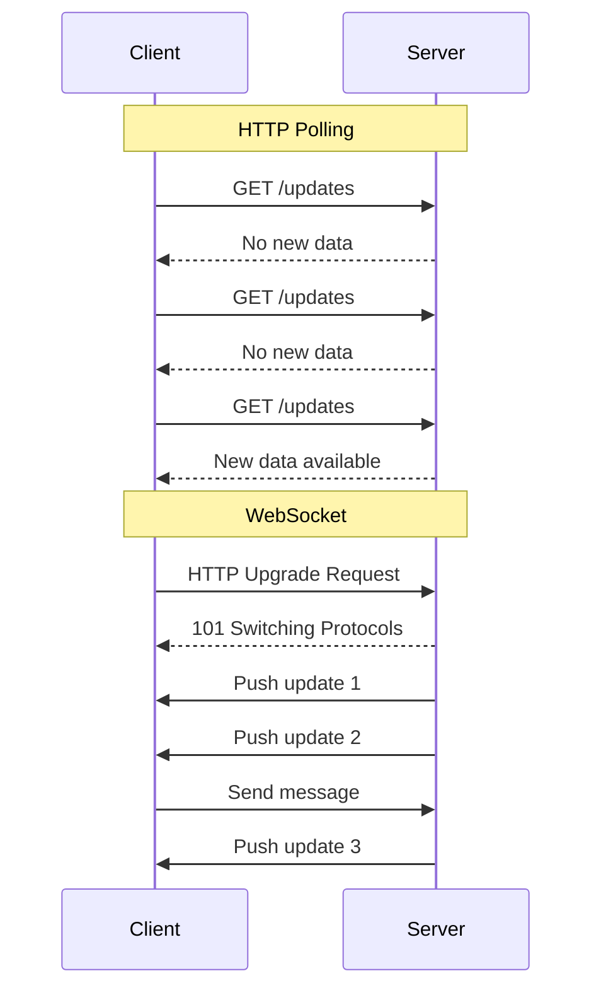

---

## 2. Understanding WebSockets

### 2.1 The WebSocket Protocol

WebSockets establish a full-duplex communication channel over a single TCP connection. The process begins with an HTTP handshake where the client sends an "Upgrade" request to switch protocols from HTTP to WebSocket. Once the server agrees, the connection is "upgraded" and remains open, allowing both parties to send messages independently.

### 2.2 Key Advantages of WebSockets

- **Low Latency:**
  With a persistent connection, the overhead of establishing a new connection for each message is eliminated, resulting in minimal delay.

- **Bi-Directional Communication:**
  Both the client and server can send data independently, enabling dynamic, interactive applications.

- **Efficiency:**
  Reduced network overhead as only messages are transmitted after the initial handshake - no repeated HTTP headers.

- **Stateful Connections:**
  Maintaining a continuous connection allows the server to push updates to clients instantly.

The following state diagram shows the full lifecycle of a WebSocket connection from opening to closure:

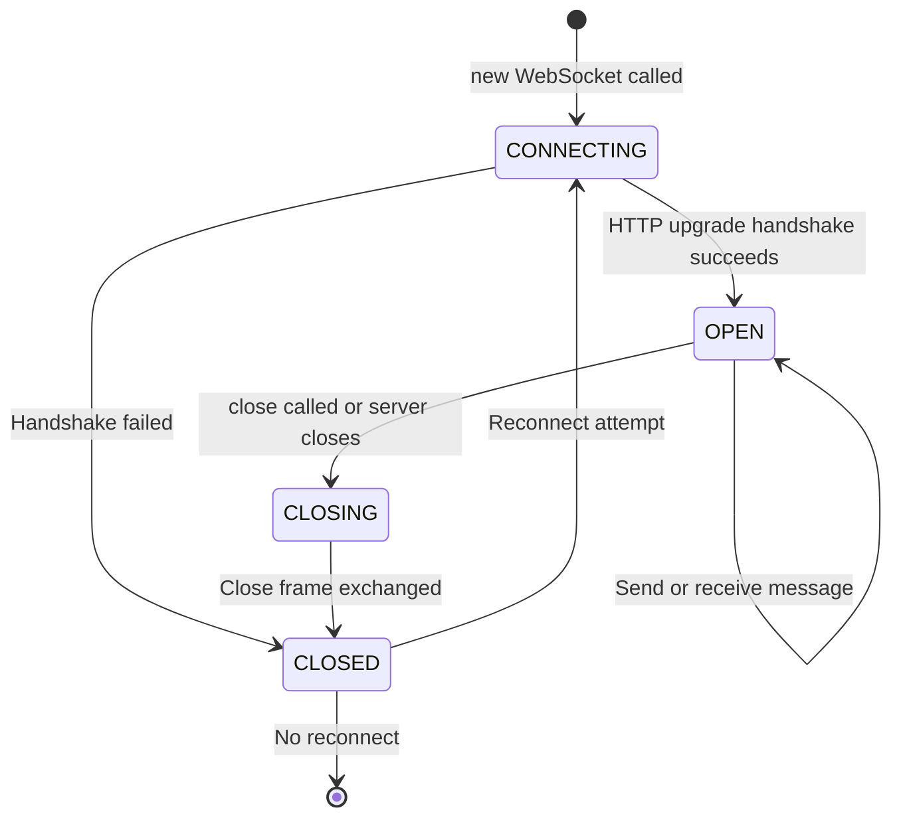

---

## 3. Setting Up a WebSocket Server with Node.js

Let’s build a basic WebSocket server using the `ws` library.

### 3.1 Installing Dependencies

First, ensure you have Node.js installed. Then, initialize your project and install the `ws` package:

```bash
# Initialize a new Node.js project
npm init -y

# Install the ws library
npm install ws
```

### 3.2 Creating the WebSocket Server

Create a file named `server.js` and add the following code:

```javascript
const WebSocket = require("ws");

// Create a WebSocket server on port 8080
const wss = new WebSocket.Server({ port: 8080 });

wss.on("connection", (ws) => {
  console.log("New client connected");

  // Send a welcome message when a client connects
  ws.send("Welcome to the WebSocket server!");

  // Handle incoming messages from clients
  ws.on("message", (message) => {
    console.log(`Received: ${message}`);
    // Echo the received message back to the client
    ws.send(`Server received: ${message}`);
  });

  // Handle client disconnection
  ws.on("close", () => {
    console.log("Client disconnected");
  });

  // Handle errors
  ws.on("error", (error) => {
    console.error("WebSocket error:", error);
  });
});

console.log("WebSocket server is running on ws://localhost:8080");
```

**Explanation:**

- **Connection Event:** When a client connects, the server logs the event and sends a welcome message.
- **Message Handling:** For each incoming message, the server logs the message and echoes it back.
- **Disconnection & Error Handling:** Proper events are set up to log disconnections and errors, which is crucial for debugging.

---

## 4. Building a Simple WebSocket Client

To test your server, you can create a simple HTML file that acts as a client.

### 4.1 Creating the Client

Create a file named `client.html` and add the following code:

```html
<!DOCTYPE html>
<html lang="en">
  <head>
    <meta charset="UTF-8" />
    <title>WebSocket Client</title>
  </head>
  <body>
    <h1>WebSocket Client</h1>
    <script>
      // Connect to the WebSocket server
      const socket = new WebSocket("ws://localhost:8080");

      // When the connection is open, send a message to the server
      socket.addEventListener("open", () => {
        console.log("Connected to the server");
        socket.send("Hello, Server!");
      });

      // Listen for messages from the server
      socket.addEventListener("message", (event) => {
        console.log("Message from server:", event.data);
      });

      // Handle connection closure
      socket.addEventListener("close", () => {
        console.log("Disconnected from the server");
      });

      // Handle errors
      socket.addEventListener("error", (error) => {
        console.error("WebSocket error:", error);
      });
    </script>
  </body>
</html>
```

**Explanation:**

- The client connects to the WebSocket server at `ws://localhost:8080`.
- Once connected, it sends a greeting message.
- It listens for messages from the server and logs them to the console.
- Proper events handle disconnection and errors.

---

## 5. Advanced Techniques and Best Practices

Building real-time applications involves more than just setting up a basic connection. Consider the following advanced topics and best practices to ensure your WebSocket application is robust and scalable.

### 5.1 Scalability

- **Load Balancing:**
  For applications with many concurrent connections, use load balancers that support sticky sessions or implement clustering. This distributes client connections across multiple server instances.

- **Horizontal Scaling:**
  Deploy multiple Node.js server instances behind a reverse proxy or use technologies like Docker and Kubernetes to manage scaling efficiently.

- **Message Broadcasting:**
  Implement mechanisms to broadcast messages to multiple clients, which is common in chat applications or live updates. The server can loop through all active connections to send updates.

The following diagram shows how WebSocket connections scale horizontally using Redis Pub/Sub to broadcast across server instances:

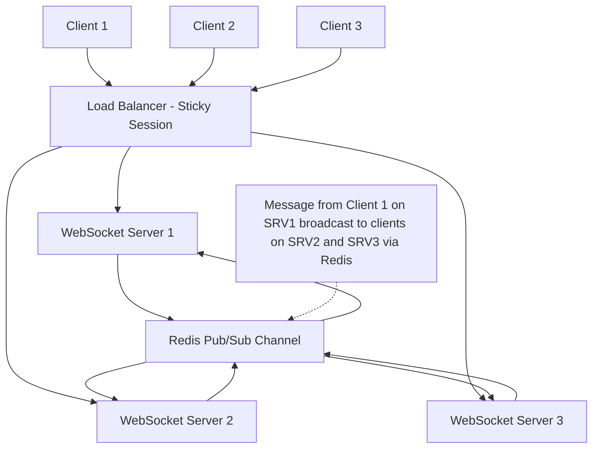

A token-based authentication flow for WebSocket connections validates the JWT during the HTTP upgrade before the persistent channel is opened:

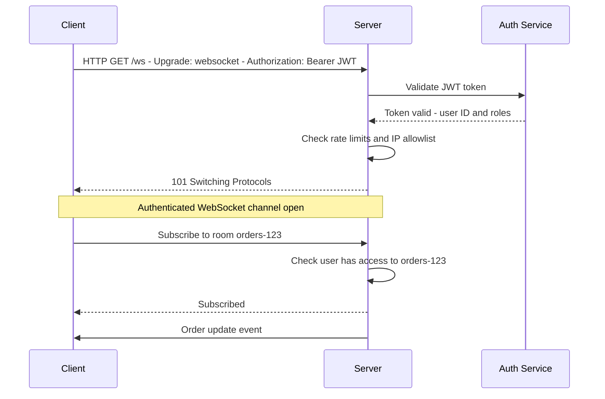

### 5.2 Security

- **Using Secure WebSockets:**
  Always use `wss://` (WebSocket Secure) in production to encrypt data between the client and server.

- **Authentication and Authorization:**
  Integrate token-based authentication (like JWT) during the WebSocket handshake to ensure that only authorized clients can connect.

- **Input Validation:**
  Validate all incoming messages to prevent injection attacks and other malicious behavior.

- **Rate Limiting:**
  Implement rate limiting to mitigate denial-of-service (DoS) attacks and ensure fair usage of resources.

### 5.3 Error Handling and Recovery

- **Reconnection Logic:**
  On the client side, implement reconnection strategies to automatically attempt to reconnect if the connection is lost.

- **Graceful Shutdowns:**
  Design your server to handle shutdowns gracefully by notifying connected clients and allowing them to reconnect once the server is back online.

The heartbeat and reconnection flow diagram shows how clients detect stale connections and recover automatically:

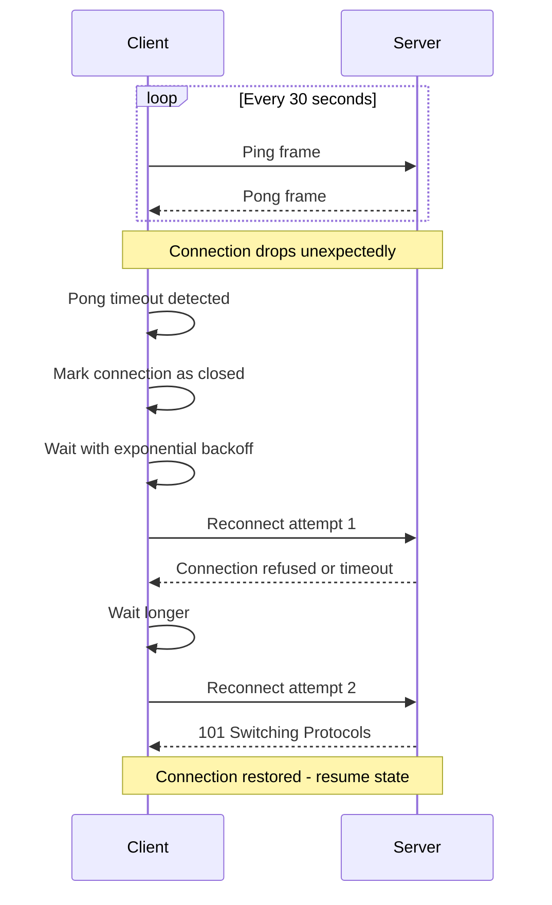

### 5.4 Monitoring and Logging

- **Connection Metrics:**
  Track the number of active connections, message rates, and error rates to monitor the health of your WebSocket server.

- **Detailed Logging:**
  Log key events such as connections, disconnections, errors, and message exchanges. This is critical for debugging and maintaining the system.

- **Performance Profiling:**
  Regularly profile your application to identify bottlenecks and optimize resource usage.

---

## 6. Use Cases for WebSockets

The following diagram shows how a load balancer distributes WebSocket connections while maintaining sticky sessions per client:

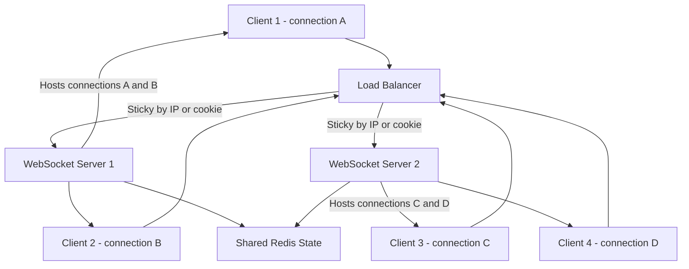

A room-based topology groups connections so that messages broadcast only to members of the same room rather than to all connected clients:

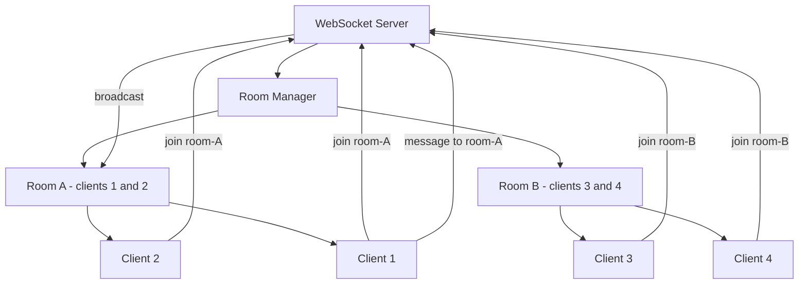

WebSockets are ideal for a variety of real-time applications:

### 6.1 Live Chat Applications

Real-time chat applications rely on WebSockets for instant message delivery between users. The persistent connection ensures that messages are delivered with minimal delay.

### 6.2 Real-Time Notifications

Applications like social networks, collaboration tools, and monitoring dashboards use WebSockets to push notifications in real time, keeping users informed without needing to refresh the page.

### 6.3 Collaborative Tools

In tools like online document editors or whiteboards, multiple users can interact in real time. WebSockets enable smooth, real-time updates, ensuring that all participants see the latest changes instantly.

### 6.4 Gaming and Interactive Applications

For multiplayer games or interactive experiences, WebSockets provide the low latency and high-speed communication necessary to synchronize game states and deliver a smooth experience.

### 6.5 Financial and Data Streaming Applications

Real-time data feeds, such as stock tickers, live sports scores, and IoT sensor data, benefit from WebSockets by providing a continuous, up-to-date stream of information.

---

## 7. Enhancing Your WebSocket Server

### 7.1 Broadcasting Messages

For many real-time applications, broadcasting messages to all connected clients is essential. You can implement broadcasting by iterating over all active connections:

```javascript
wss.on("connection", (ws) => {
  // Broadcast a message to all clients
  ws.on("message", (message) => {
    wss.clients.forEach((client) => {
      if (client.readyState === WebSocket.OPEN) {
        client.send(`Broadcast: ${message}`);
      }
    });
  });
});
```

### 7.2 Handling Multiple Message Types

Real-world applications often need to handle various types of messages. Consider using a simple protocol (e.g., JSON messages with a type field) to differentiate between different kinds of data:

```javascript
ws.on("message", (data) => {
  let message;
  try {
    message = JSON.parse(data);
  } catch (error) {
    console.error("Invalid JSON:", data);
    return;
  }

  switch (message.type) {
    case "chat":
      // Handle chat message
      break;
    case "update":
      // Handle data update
      break;
    default:
      console.warn("Unknown message type:", message.type);
  }
});
```

The WebSocket wire frame structure shows the binary layout of each frame exchanged after the handshake:

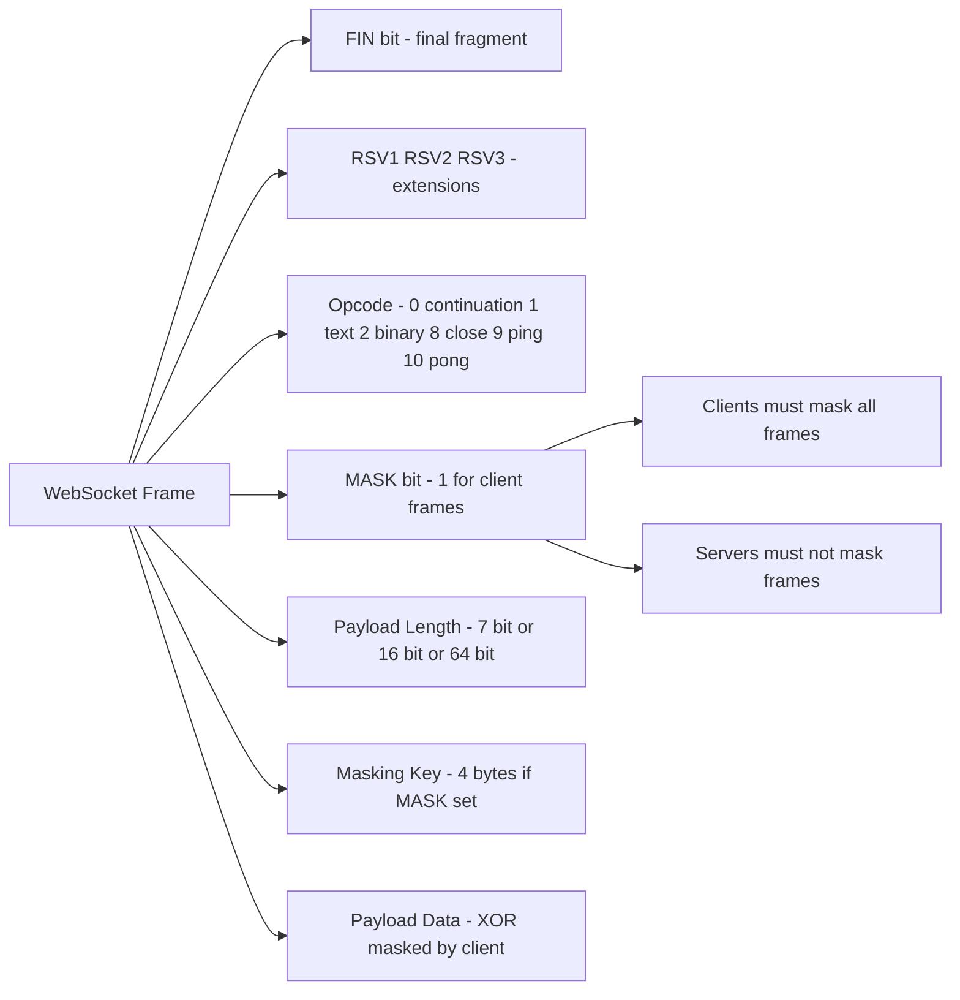

### 7.3 Integrating with Other Technologies

- **Socket.io:**
  For more advanced features like automatic reconnection, room management, and broadcasting, consider libraries like Socket.io. While this article focuses on the `ws` library, exploring alternatives can be beneficial for larger projects.

- **RESTful APIs:**
  Combine WebSockets with traditional REST APIs to handle both real-time and non-real-time data needs efficiently.

---

## 8. Challenges and Considerations

While WebSockets offer significant advantages, there are challenges to be aware of:

- **Connection Management:**
  Maintaining persistent connections for thousands of clients requires careful resource management and robust server architecture.

- **Firewall and Proxy Issues:**
  Some networks and proxies may block WebSocket connections. It’s important to test your application in various environments.

- **Data Consistency:**
  In systems where both HTTP and WebSocket communications are used, ensuring consistency across different communication channels can be challenging.

- **Complexity in Error Handling:**
  Building robust reconnection and error-handling logic is essential but can add complexity to your codebase.

The state diagram for message delivery ordering shows how a client handles out-of-order messages using sequence numbers:

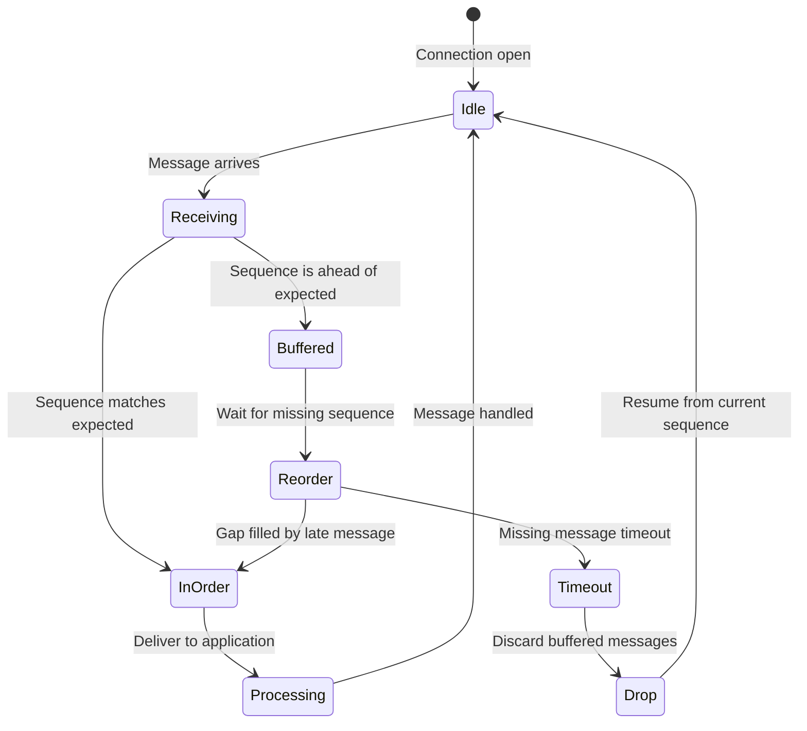

---

## 9. Socket.io vs Raw ws: Choosing the Right Abstraction

The `ws` library gives you direct protocol control, but Socket.io adds a feature layer that many production applications need. Understanding the tradeoffs is essential before committing to either approach.

### 9.1 Feature Comparison

| Capability                   | ws (raw) | Socket.io                         |
| ---------------------------- | -------- | --------------------------------- |
| Auto-reconnect               | Manual   | Built-in with exponential backoff |
| Rooms and namespaces         | Manual   | First-class API                   |
| Fallback to HTTP long-poll   | No       | Yes                               |
| Binary data                  | Yes      | Yes                               |
| Acknowledgements (RPC style) | Manual   | Built-in callbacks                |
| Middleware support           | No       | Yes                               |
| Broadcast to subset          | Manual   | `io.to(room).emit()`              |

### 9.2 Socket.io Server with Rooms

```javascript
const { Server } = require("socket.io");
const { createServer } = require("http");
const express = require("express");

const app = express();
const httpServer = createServer(app);
const io = new Server(httpServer, {
  cors: { origin: "*" },
  pingTimeout: 60000,
  pingInterval: 25000,
});

io.on("connection", (socket) => {
  console.log(`Client connected: ${socket.id}`);

  // Join a named room
  socket.on("join-room", (roomId, userId) => {
    socket.join(roomId);
    socket.to(roomId).emit("user-joined", { userId, socketId: socket.id });
    console.log(`${userId} joined room ${roomId}`);
  });

  // Broadcast to everyone in the room except sender
  socket.on("room-message", ({ roomId, message, author }) => {
    socket
      .to(roomId)
      .emit("room-message", { message, author, timestamp: Date.now() });
  });

  // Acknowledgement pattern (RPC style)
  socket.on("fetch-history", (roomId, callback) => {
    const history = getMessageHistory(roomId); // your data layer
    callback({ status: "ok", messages: history });
  });

  socket.on("disconnect", (reason) => {
    console.log(`Client ${socket.id} disconnected: ${reason}`);
  });
});

httpServer.listen(3000);
```

### 9.3 Socket.io Client with Reconnection Strategy

```javascript
import { io } from "socket.io-client";

const socket = io("wss://api.example.com", {
  auth: { token: localStorage.getItem("jwt") },
  reconnection: true,
  reconnectionAttempts: 10,
  reconnectionDelay: 1000,
  reconnectionDelayMax: 30000,
  randomizationFactor: 0.5,
});

socket.on("connect", () => {
  console.log("Connected:", socket.id);
  socket.emit("join-room", "channel-42", "user-007");
});

socket.on("room-message", ({ message, author, timestamp }) => {
  renderMessage({ message, author, time: new Date(timestamp) });
});

socket.on("connect_error", (err) => {
  console.error("Connection error:", err.message);
  if (err.message === "unauthorized") {
    redirectToLogin();
  }
});
```

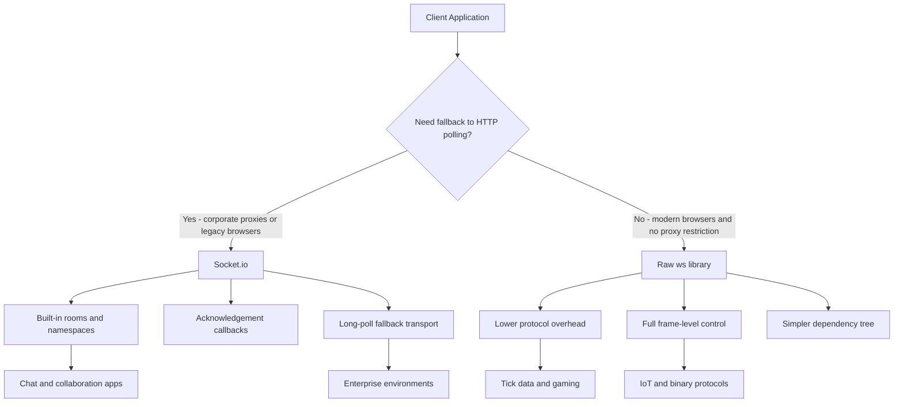

---

## 10. WebSocket Compression with permessage-deflate

For text-heavy applications (JSON APIs, chat), the `permessage-deflate` extension can reduce payload size by 60-80% with minimal CPU overhead.

### 10.1. Enabling Compression on the Server

```javascript
const WebSocket = require("ws");

const wss = new WebSocket.Server({
  port: 8080,
  perMessageDeflate: {
    zlibDeflateOptions: {
      chunkSize: 1024,
      memLevel: 7,
      level: 3, // Compression level 1-9. 3 is a good CPU/size tradeoff.
    },
    zlibInflateOptions: {
      chunkSize: 10 * 1024,
    },
    clientNoContextTakeover: true, // Prevent context sharing across messages
    serverNoContextTakeover: true,
    serverMaxWindowBits: 10,
    concurrencyLimit: 10,
    threshold: 1024, // Only compress messages larger than 1 KB
  },
});

wss.on("connection", (ws) => {
  ws.on("message", (data, isBinary) => {
    if (!isBinary) {
      const json = JSON.parse(data.toString());
      ws.send(JSON.stringify({ echo: json, compressed: true }));
    }
  });
});
```

### 10.2. Compression Decision Tree

The following decision tree shows how the server determines whether and how to apply DEFLATE compression based on message size and type:

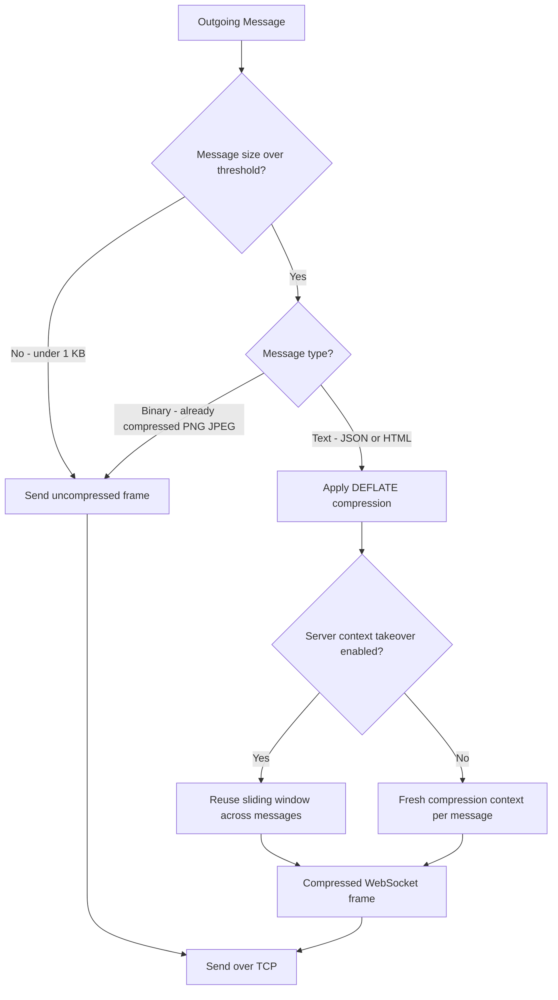

---

## 11. Connection Pool Management and Backpressure

Under heavy load, naively accepting unlimited connections causes memory exhaustion. A connection pool with backpressure signals prevents server overload.

### 11.1. Connection Limiter

```javascript
const WebSocket = require("ws");

const MAX_CONNECTIONS = 10000;
const wss = new WebSocket.Server({ port: 8080, noServer: true });
let connectionCount = 0;

const httpServer = require("http").createServer();

httpServer.on("upgrade", (request, socket, head) => {
  if (connectionCount >= MAX_CONNECTIONS) {
    socket.write("HTTP/1.1 503 Service Unavailable\r\n\r\n");
    socket.destroy();
    return;
  }
  wss.handleUpgrade(request, socket, head, (ws) => {
    wss.emit("connection", ws, request);
  });
});

wss.on("connection", (ws) => {
  connectionCount++;
  console.log(`Active connections: ${connectionCount}`);

  // Apply per-connection send queue to prevent write buffer overflow
  let sendQueue = [];
  let isFlushing = false;

  ws.sendQueued = function (data) {
    sendQueue.push(data);
    if (!isFlushing) flushQueue();
  };

  function flushQueue() {
    if (sendQueue.length === 0) {
      isFlushing = false;
      return;
    }
    isFlushing = true;
    const msg = sendQueue.shift();
    ws.send(msg, (err) => {
      if (err) console.error("Send error:", err);
      flushQueue();
    });
  }

  ws.on("close", () => {
    connectionCount--;
    sendQueue = [];
  });
});

httpServer.listen(8080);
```

### 11.2. Connection Pool Lifecycle

The following state diagram shows all the states a managed connection moves through, including backpressure handling and idle ping/pong health checks:

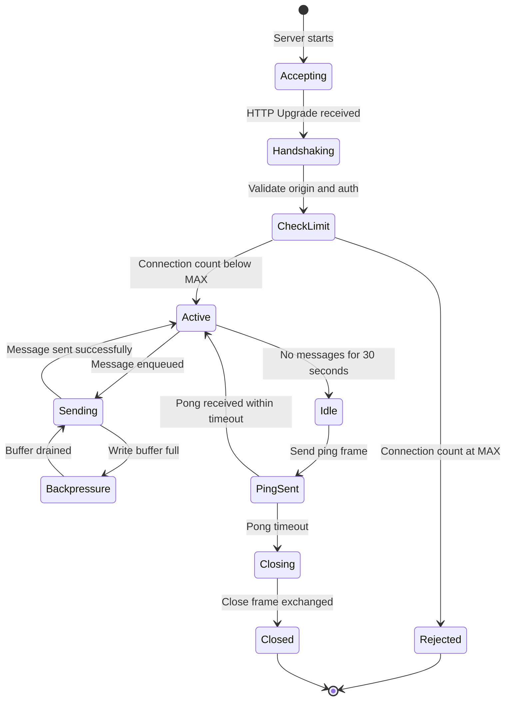

---

## 12. WebTransport: The Next-Generation Alternative

WebTransport is a new browser API built on HTTP/3 and QUIC that addresses some fundamental limitations of WebSockets.

### 12.1. Key Differences from WebSockets

- **Multiple streams:** WebTransport supports multiple independent bidirectional and unidirectional byte streams over a single QUIC connection, eliminating head-of-line blocking.
- **Datagrams:** Unreliable, unordered datagrams are first-class citizens, ideal for real-time game state or sensor telemetry where freshness matters more than completeness.
- **0-RTT reconnection:** QUIC's 0-RTT feature allows session resumption without a full handshake, dramatically reducing reconnect latency.

### 12.2. WebTransport Client Example

```javascript
// WebTransport is available in Chrome 97+ and Edge 97+
const transport = new WebTransport("https://example.com:4433/ws");

await transport.ready;
console.log("WebTransport connection established");

// Send a datagram (unreliable, low-latency)
const writer = transport.datagrams.writable.getWriter();
await writer.write(
  new TextEncoder().encode(JSON.stringify({ type: "position", x: 42, y: 100 })),
);

// Open a reliable bidirectional stream
const stream = await transport.createBidirectionalStream();
const streamWriter = stream.writable.getWriter();
await streamWriter.write(new TextEncoder().encode("reliable message"));

// Read from stream
const reader = stream.readable.getReader();
const { value } = await reader.read();
console.log("Received:", new TextDecoder().decode(value));

transport.closed.then(() => console.log("Connection closed"));
```

The following diagram compares the two protocols and maps each to its ideal use case:

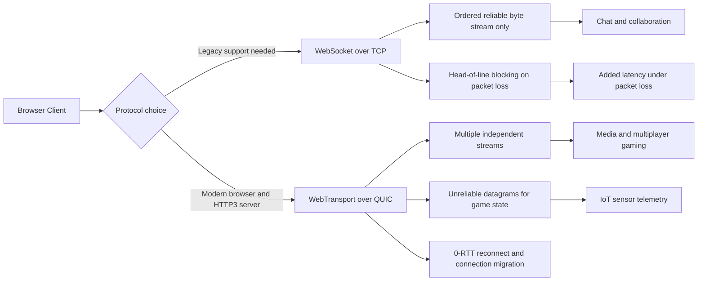

---

## 13. Future Directions

Real-time web technologies are rapidly evolving. Here are some emerging trends:

- **Serverless WebSockets:**
  Services like AWS API Gateway now support WebSocket APIs, enabling scalable, serverless real-time applications.

- **Edge Computing:**
  Moving real-time processing closer to users at the network edge can further reduce latency and improve performance.

- **Enhanced Protocols:**
  Future developments may include enhancements to the WebSocket protocol itself or new protocols designed specifically for real-time applications.

- **Integration with AI:**
  Real-time applications incorporating AI for predictive analytics or natural language processing can further enhance user experiences.

---

## 14. Conclusion

WebSockets have redefined how real-time communication is implemented in modern web applications. By establishing a persistent, bi-directional connection between the client and server, WebSockets overcome the limitations of traditional HTTP-based communication and enable rapid, interactive experiences.

In this guide, we’ve covered the fundamentals of the WebSocket protocol, detailed how to build a server and client using Node.js and the `ws` library, and explored best practices for scaling, securing, and optimizing your real-time applications. As web applications continue to demand higher performance and interactivity, mastering WebSockets will be crucial for developers looking to deliver exceptional user experiences.

Explore further enhancements with alternative libraries, serverless solutions, and edge computing to stay ahead in the rapidly evolving landscape of real-time web development.

---

## 15. Further Reading and Resources

- **Official Documentation:**
  [WebSocket API on MDN](https://developer.mozilla.org/en-US/docs/Web/API/WebSockets_API)
  [ws Library Documentation](https://www.npmjs.com/package/ws)

- **Tutorials and Courses:**
  Explore tutorials on platforms like Udemy, Coursera, and Pluralsight focused on real-time web development with Node.js and WebSockets.

- **Books:**
  _"Node.js Design Patterns"_ by Mario Casciaro and Luciano Mammino provides insights into building scalable Node.js applications, including real-time systems.

- **Communities:**
  Join forums, GitHub repositories, and online communities such as Stack Overflow or the Node.js Slack channel to discuss best practices and troubleshoot issues related to WebSockets.

---

_This comprehensive guide on real-time communication with WebSockets in Node.js is designed to equip you with the knowledge and tools to build scalable, secure, and efficient real-time applications. Dive in, experiment, and innovate to create interactive web experiences that stand out in today’s digital landscape._
