import MdxLayout from "@/components/MdxLayout";

export const metadata = {
  title: "Zero Trust Security: Designing Systems That Assume Breach",
  description:
    "An in-depth overview of zero trust security, covering identity, network segmentation, device posture, and implementation strategy.",
  topics: ["Security", "Architecture", "System Design", "Infrastructure"],
};

export default function ZeroTrustSecurityArticle({ children }) {
  return <MdxLayout>{children}</MdxLayout>;
}

# Zero Trust Security: Designing Systems That Assume Breach

### Author: Son Nguyen

> Date: 2024-12-20

Zero trust is a security model that assumes no implicit trust between users, devices, or networks. Every request is continuously verified based on identity, context, and policy. This article explains the components of zero trust and how to implement it without stopping delivery velocity.

---

## 1. Core principles

Zero trust rests on three principles:

- **Verify explicitly:** Authenticate and authorize every request.
- **Use least privilege:** Limit access to only what is required.
- **Assume breach:** Design for lateral movement resistance.

These principles shift security from perimeter defense to continuous verification.

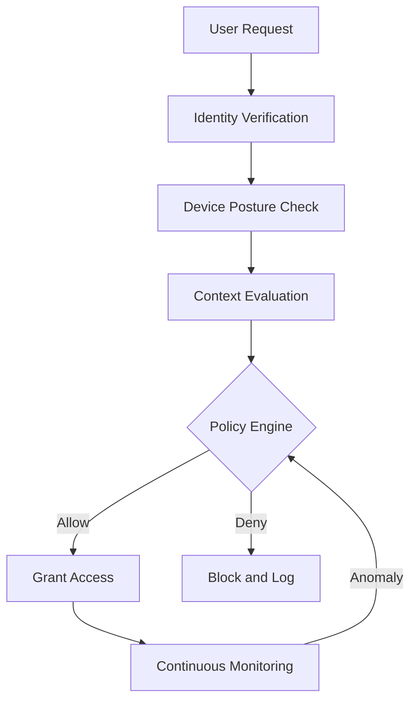

---

## 2. Identity as the control plane

Identity replaces the network as the primary control point:

- Centralized identity providers (IdP) for users and services.
- Short-lived credentials and automatic rotation.
- Conditional access policies based on user role, device health, and location.

Every service should validate identity and policy before granting access.

---

## 3. Network segmentation and micro-perimeters

Segment the network to reduce blast radius:

- Separate critical workloads into isolated zones.
- Use service meshes with mutual TLS for east-west traffic.
- Enforce explicit allowlists instead of broad network trust.

Segmentation limits how far an attacker can move if a system is compromised.

The following diagram illustrates micro-perimeter network segmentation with explicit allowlists between zones:

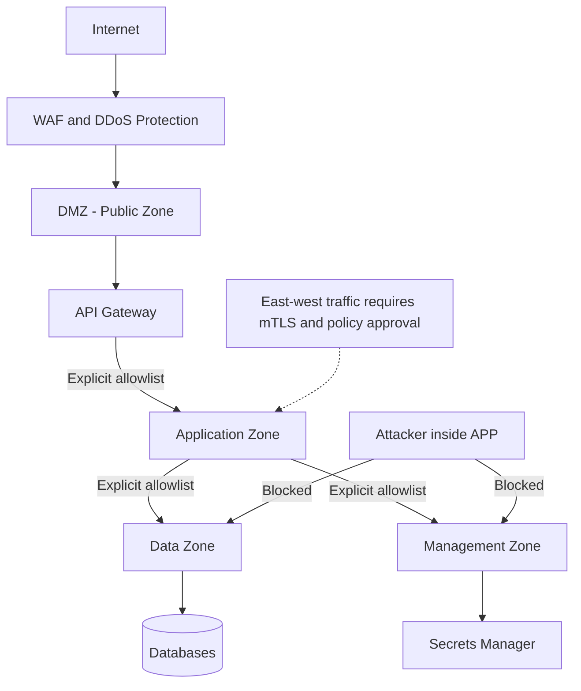

---

## 4. Device posture and endpoint trust

Endpoints are a common weak link. Strengthen them with:

- Device compliance checks (OS version, disk encryption, EDR).
- Certificate-based authentication for managed devices.
- Just-in-time access for privileged actions.

Access decisions should be denied if device posture is unknown or risky.

The device posture evaluation flow shows how endpoint health determines whether access is granted, limited, or denied:

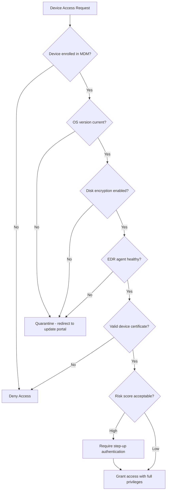

Just-in-time privileged access eliminates standing permissions by granting time-bound credentials only when a request is approved:

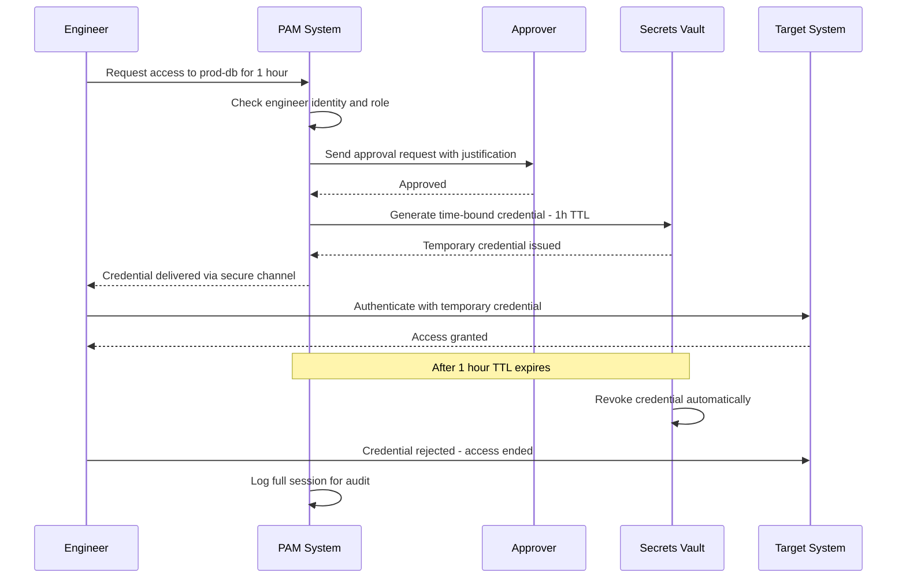

---

## 5. Data protection and encryption

Data is the ultimate asset. Protect it by:

- Encrypting data in transit and at rest.
- Using field-level encryption for sensitive attributes.
- Applying data loss prevention (DLP) and exfiltration monitoring.

Plan for both accidental leaks and malicious exfiltration.

Data classification tiers determine the encryption strength, access controls, and residency requirements applied to each category:

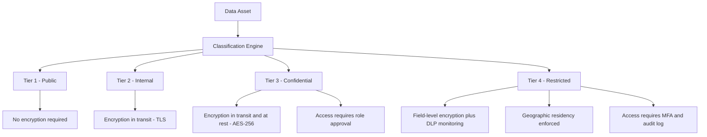

---

## 6. Policy engines and access brokers

Zero trust relies on policy enforcement points:

- Central policy engines evaluate identity, device, and context.
- Access proxies enforce decisions at every request.
- Policies should be versioned, tested, and auditable.

A strong policy layer prevents ad-hoc exceptions from becoming vulnerabilities.

---

## 7. Service-to-service authentication

Internal traffic needs the same scrutiny as external access:

- Use mutual TLS and service identities.
- Rotate credentials automatically.
- Enforce least-privilege service roles.

Service-to-service identity prevents attackers from moving laterally after a breach.

The following sequence diagram shows a mutual TLS handshake between two internal services:

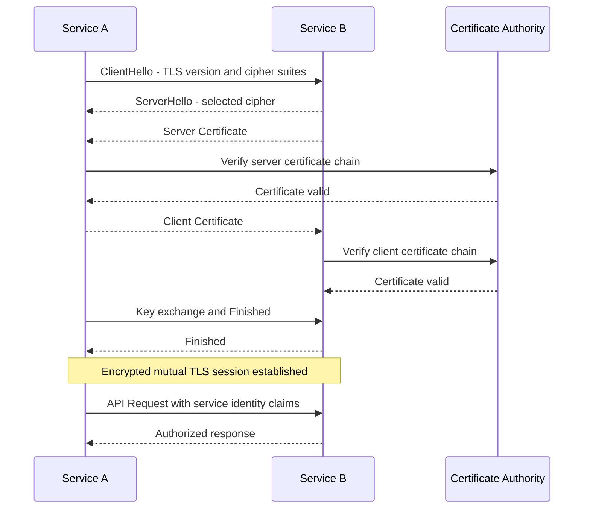

The secrets rotation lifecycle ensures credentials are never long-lived and rotation is automatic and auditable:

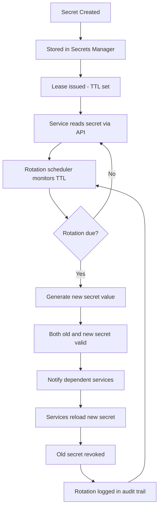

---

## 8. Logging, monitoring, and response

Zero trust depends on continuous visibility:

- Centralize audit logs for every access decision.
- Alert on anomalous access patterns.
- Build response workflows for policy violations.

Monitoring makes policy enforcement measurable and improvable.

---

## 9. Migration strategy

The identity provider federation diagram shows how multiple identity sources are unified through a central IdP for consistent policy enforcement:

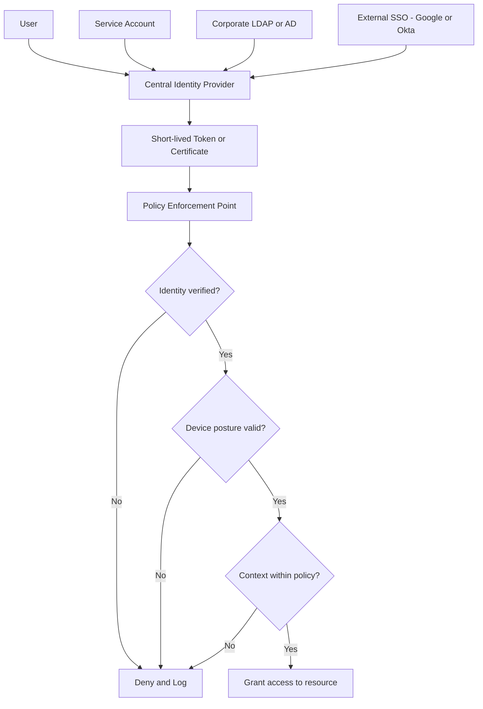

Zero trust is a journey, not a single project:

- Start with high-risk systems and privileged access paths.
- Inventory critical services and map trust relationships.
- Roll out policies incrementally with monitoring and rollback plans.

Adopt a phased approach to avoid blocking core business workflows.

The incident response workflow shows how a detected anomaly escalates through investigation and containment under a zero trust model:

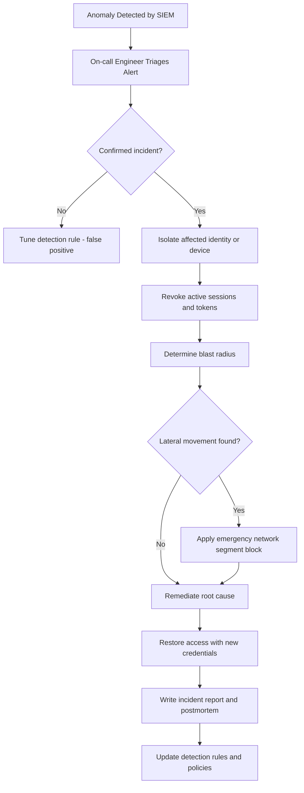

---

## 10. Common pitfalls

Watch out for:

- Overly strict policies that break developer productivity.
- Shadow access paths that bypass the identity layer.
- Weak service-to-service authentication.

Zero trust only works when it is enforced consistently.

---

## 11. Implementation checklist

- Centralize identity and enforce MFA.
- Require mutual TLS for service traffic.
- Implement device posture checks.
- Log and audit every access decision.
- Review policies regularly and tune for usability.

Zero trust shifts security from a perimeter mindset to continuous, identity-driven control. Done well, it reduces breach impact while keeping systems usable.

---

## 12. SASE architecture

Secure Access Service Edge (SASE) converges networking and security into a cloud-delivered service. Where traditional zero trust focuses on identity and policy, SASE extends that model to include WAN optimization, DNS security, cloud access security broker (CASB), and zero trust network access (ZTNA) in a single fabric.

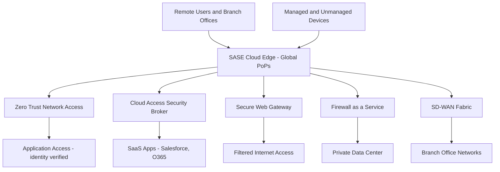

### SASE versus classic VPN

| Dimension          | Classic VPN                      | SASE with ZTNA                                |
| ------------------ | -------------------------------- | --------------------------------------------- |
| Trust model        | Network-level trust after login  | Per-request identity and posture verification |
| Access scope       | Broad network segment            | Specific application only                     |
| Performance        | Hairpins through central gateway | Direct route to nearest PoP                   |
| Device requirement | VPN client on managed device     | Lightweight agent or agentless                |
| Lateral movement   | Possible within segment          | Prevented by micro-perimeters                 |
| Scalability        | Limited by VPN concentrator      | Elastic cloud scale                           |

SASE providers like Cloudflare Access, Zscaler Private Access, and Netskope implement this model as managed cloud services that integrate with existing IdPs.

---

## 13. Zero trust for APIs

APIs are a major attack surface in distributed systems. Traditional API gateways provide routing and rate limiting but often lack the identity granularity zero trust requires.

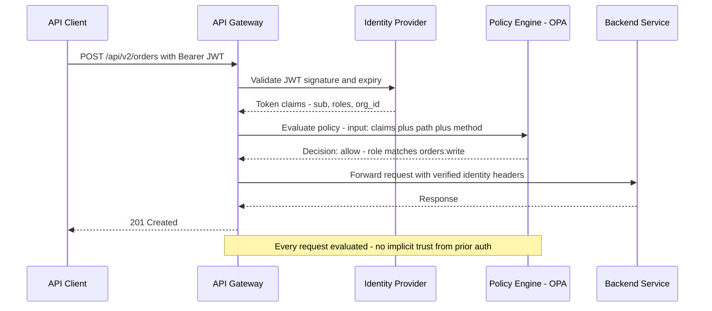

### API-level zero trust controls

```typescript
// Express.js middleware: zero trust API gate with OPA
import { Request, Response, NextFunction } from "express";
import jwt from "jsonwebtoken";

interface TokenClaims {
  sub: string;
  roles: string[];
  org_id: string;
  device_posture: "compliant" | "unknown" | "non-compliant";
}

async function zeroTrustGate(
  req: Request,
  res: Response,
  next: NextFunction,
): Promise<void> {
  const token = req.headers.authorization?.replace("Bearer ", "");

  if (!token) {
    res.status(401).json({ error: "Missing authorization token" });
    return;
  }

  let claims: TokenClaims;
  try {
    claims = jwt.verify(token, process.env.JWT_PUBLIC_KEY!) as TokenClaims;
  } catch {
    res.status(401).json({ error: "Invalid or expired token" });
    return;
  }

  // Reject requests from non-compliant devices for sensitive endpoints
  if (
    req.path.startsWith("/api/admin") &&
    claims.device_posture !== "compliant"
  ) {
    res.status(403).json({ error: "Device posture check failed" });
    return;
  }

  // Evaluate policy with OPA
  const opaInput = {
    method: req.method,
    path: req.path,
    claims,
    source_ip: req.ip,
    timestamp: new Date().toISOString(),
  };

  const opaResponse = await fetch(`${process.env.OPA_URL}/v1/data/api/allow`, {
    method: "POST",
    headers: { "Content-Type": "application/json" },
    body: JSON.stringify({ input: opaInput }),
  });

  const { result } = await opaResponse.json();

  if (!result) {
    // Log denial for audit trail
    console.log(
      JSON.stringify({
        event: "access_denied",
        sub: claims.sub,
        path: req.path,
        method: req.method,
        timestamp: new Date().toISOString(),
      }),
    );
    res.status(403).json({ error: "Access denied by policy" });
    return;
  }

  // Attach verified identity to request context
  res.locals.identity = claims;
  next();
}

export default zeroTrustGate;
```

---

## 14. Policy-as-code with OPA

Open Policy Agent (OPA) separates policy decisions from application logic. Policies are expressed in Rego, stored in version control, tested like code, and evaluated at runtime by any service that can make an HTTP call.

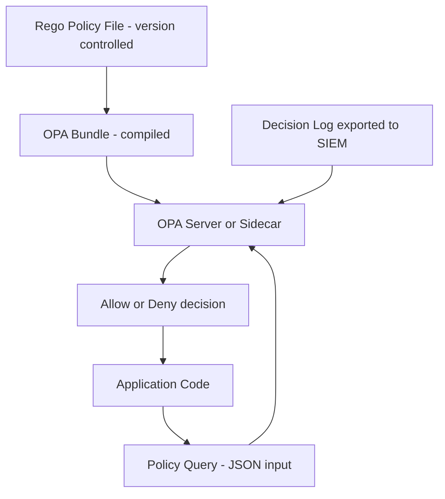

### OPA Rego policy example

```rego
# policy/api.rego
package api

import future.keywords.in

# Default deny
default allow := false

# Allow read access to own resources
allow if {
    input.method in {"GET", "HEAD"}
    resource_owner == input.claims.sub
}

# Allow write access for users with the correct role
allow if {
    input.method in {"POST", "PUT", "PATCH"}
    "orders:write" in input.claims.roles
    input.claims.org_id == extracted_org_id
}

# Admin access requires both admin role and compliant device
allow if {
    startswith(input.path, "/api/admin")
    "admin" in input.claims.roles
    input.claims.device_posture == "compliant"
}

# Helper rules
resource_owner := owner if {
    parts := split(input.path, "/")
    count(parts) >= 4
    owner := parts[3]
}

extracted_org_id := org if {
    parts := split(input.path, "/")
    org := parts[2]
}
```

```bash
# Test the policy locally before deploying
opa test policy/ -v

# Run OPA as a sidecar in Kubernetes
kubectl apply -f - <<EOF
apiVersion: v1
kind: ConfigMap
metadata:
  name: opa-policy
data:
  api.rego: |
    package api
    default allow := false
    allow if { "orders:write" in input.claims.roles }
EOF
```

---

## 15. Audit logging patterns

Zero trust without comprehensive audit logging is incomplete. Every allow and deny decision must be recorded with enough context to reconstruct what happened and why.

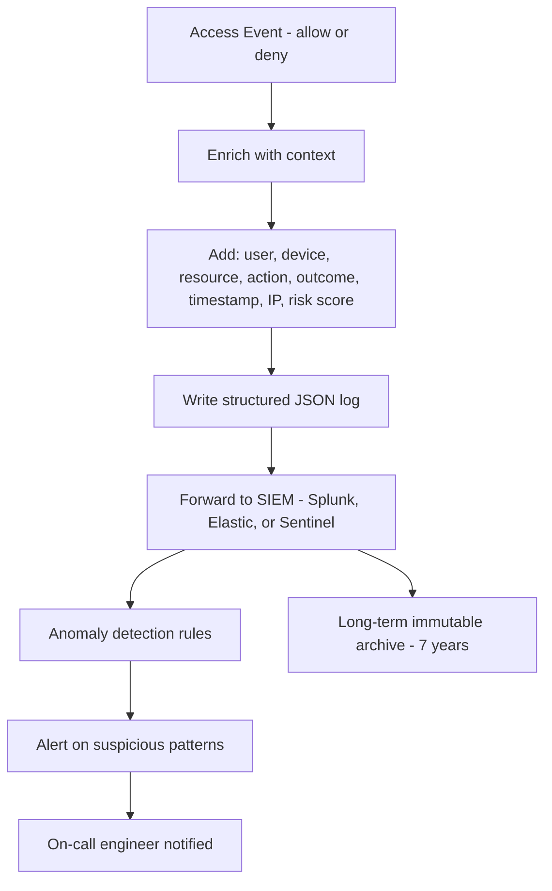

### Audit log schema

```typescript
interface AuditLogEntry {
  // Mandatory fields
  event_id: string; // UUID for deduplication
  timestamp: string; // ISO 8601
  event_type: "access.allow" | "access.deny" | "token.issued" | "token.revoked";

  // Principal
  subject_id: string; // User or service account identifier
  subject_type: "human" | "service";
  org_id: string;

  // Resource
  resource_type: string; // e.g., "api_endpoint", "database_row"
  resource_id: string;
  action: string; // e.g., "read", "write", "delete"

  // Context
  source_ip: string;
  device_id: string | null;
  device_posture: "compliant" | "unknown" | "non-compliant";
  session_id: string;

  // Decision
  outcome: "allow" | "deny";
  policy_version: string; // Which policy version made the decision
  deny_reason?: string; // Populated on deny

  // Risk
  risk_score: number; // 0-100
  anomaly_flags: string[]; // e.g., ["unusual_location", "off_hours"]
}
```

### Alert patterns for audit logs

Certain patterns in audit logs warrant automatic alerting:

| Pattern                                     | Signal                                      | Action                      |
| ------------------------------------------- | ------------------------------------------- | --------------------------- |
| Deny rate spike for a user                  | Credential stuffing or misconfigured policy | Alert + temporary lockout   |
| Access from new geography                   | Account takeover or VPN bypass              | Step-up auth challenge      |
| Bulk read of sensitive records              | Data exfiltration attempt                   | Alert + session review      |
| Privileged access outside business hours    | Insider threat or compromised admin         | Alert + require re-approval |
| Service account accessing unusual resources | Lateral movement after compromise           | Isolate service identity    |

---

## 16. Comparison: zero trust maturity levels

Zero trust is a spectrum. Organizations progress through maturity levels over time:

| Level | Name            | Characteristics                                                            |
| ----- | --------------- | -------------------------------------------------------------------------- |
| 0     | Perimeter-based | Firewall trust, VPN for remote, implicit internal trust                    |
| 1     | Identity-aware  | SSO and MFA in place; limited device checks                                |
| 2     | Device-aware    | MDM enrollment required; posture-based access decisions                    |
| 3     | Workload-aware  | mTLS between services; service identities via SPIFFE/SPIRE                 |
| 4     | Data-aware      | Field-level encryption; DLP policies; data classification drives access    |
| 5     | Fully dynamic   | Continuous risk scoring; behavioral analytics; real-time policy adaptation |

Most production organizations operate at level 2-3. Reaching level 4-5 requires significant investment in data classification, behavioral analytics, and automated response pipelines.

---

## 17. Conclusion

Zero trust is not a product you install — it is a security posture that organizations adopt incrementally. The core principles of verify explicitly, use least privilege, and assume breach work together to reduce the blast radius of any individual compromise. Starting with identity and privileged access controls provides the highest immediate return. Adding device posture checks, network micro-segmentation, and mutual TLS for service traffic progressively closes the gaps an attacker could exploit after an initial foothold. Policy-as-code with tools like OPA keeps enforcement consistent, auditable, and testable. Comprehensive audit logging turns the model from a passive architecture into an active detection and response capability. Zero trust done well reduces breach impact while keeping systems usable — the two goals that traditional perimeter security forces teams to trade off against each other.

---

## 18. Further Reading and Resources

- **Standards and Frameworks:**
  NIST SP 800-207, _Zero Trust Architecture_ — the definitive government reference for zero trust principles and deployment models.
  CISA Zero Trust Maturity Model — a practical maturity framework for federal agencies that applies equally well to enterprise environments.

- **Open Source Tools:**
  [Open Policy Agent (OPA)](https://www.openpolicyagent.org/) — policy engine for unified, context-aware authorization across services.
  [SPIFFE / SPIRE](https://spiffe.io/) — workload identity standard and runtime for issuing short-lived X.509 certificates to services.
  [Envoy Proxy](https://www.envoyproxy.io/) — sidecar proxy used in service meshes to enforce mTLS and policy at the network layer.

- **Cloud Provider Documentation:**
  Google BeyondCorp Enterprise — one of the earliest and most documented real-world zero trust deployments.
  AWS IAM Identity Center and AWS Verified Access — AWS-native building blocks for zero trust access patterns.
  Azure AD Conditional Access and Microsoft Entra — Microsoft's identity-driven zero trust implementation guide.

- **Books:**
  _Zero Trust Networks_ by Evan Gilman and Doug Barth — practical introduction to zero trust network architecture.
  _The Practice of Network Security Monitoring_ by Richard Bejtlich — foundational guidance on continuous visibility, a prerequisite for effective zero trust.

---
